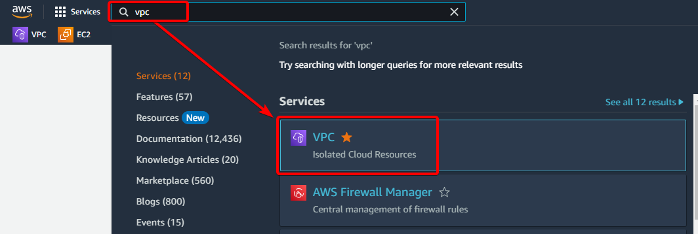
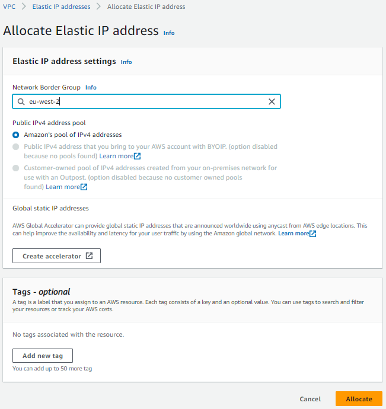
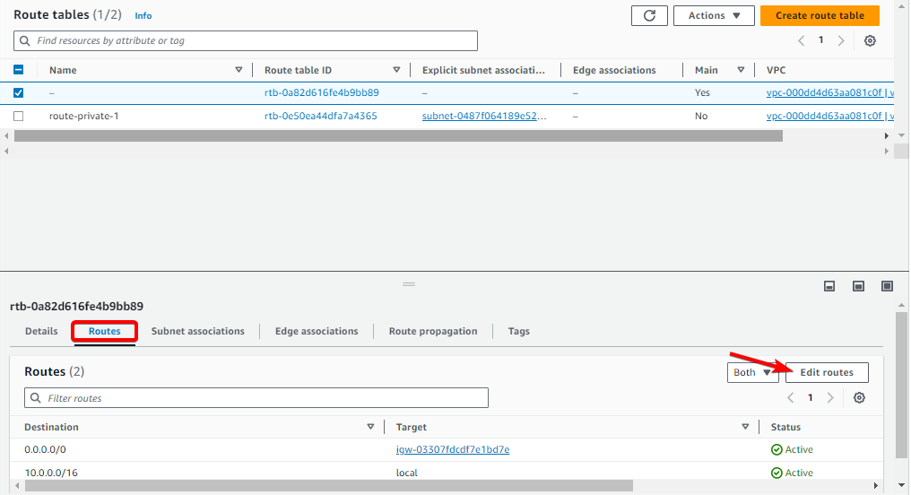

# Amazon Web Services (AWS)

Deploying infrastructure can present challenges such as space requirements, environmental controls, and maintenance efforts. However, Amazon Web Services (AWS), one of the leading cloud platforms, tackles these issues head-on by providing scalable and flexible cloud solutions that eliminate the need for physical servers. Numerous companies leverage this solution and Navixy is not an exception. With just a few simple steps, you can acquire a ready-to-use Navixy On-Premise. This page tells you what steps you need to take on AWS before running the Navixy On-premise solution.


Kindly take note that the following are the main steps to ensure a reliable and functional cloud server setup. Fine-tuning the cloud server and network is an extensive task for a system administrator. If you need more information on any of the features, please refer to the manuals on the AWS website: [https://docs.aws.amazon.com/index.html](https://docs.aws.amazon.com/index.html)


In short - you need to create:

1. Network environment in which your future server will exist, and
2. Select the necessary parameters of the virtual machine

These are the same steps you would take in case of a hardware server, but here you don't have to deal with physical installation.

## Network

First, you need to set up a network environment for your future server.

Open VPC (you can find it in the "Services" menu in the upper left corner or just use the search bar).

### **VPC** (virtual private cloud)

This is a service for creating isolated private networks on AWS.

Create a new VOC. Specify a local IP address range in IPv4 CIDR.

### **Subnets**

Here you can create multiple subnets for various purposes. Basically you need to have two subnets:

* private - does not have direct access to the Internet, only through public networks and NAT.
* public - can access the Internet via Elastic IP and Internet Gateway.

You need to assign different CIDR blocks (lesser subnet masks) within your VPC address range to the new subnets.

### **Internet gateways**

A public network can have direct access to the Internet through a gateway. This is a virtual device that allows your host that has an Elastic IP (see below) to access the Internet. Create a new gateway:

Attach it to your VPC (Actions → attach to VPC):

### Elastic IPs

Here you can get external IP addresses for your instance to communicate with the internet. Click the "Allocate Elastic IP Address" button, which will allocate a new external IP address for you.

### NAT gateways

NAT allows private networks to access the Internet. This can be useful, for example, for software updates on your servers.

Create the new NAT gateway and assign the previously created Elastic IP to it.

### Route tables

Route tables determine how traffic is distributed across your subnets.

When you create subnets, a default routing table is created. Click on it, then select the Routes tab at the bottom of the page and click “Edit Routes”.

Click “Add route”, specify the destination 0.0.0.0/0. In Target column select “Internet gateway” and select the gateway you created previously. Save changes.

This will allow the external connections to the new instance over the internet gateway.

Create another route table - it will be used for private network. Select your VPC during the creation.

Select the Routes tab for the new table at the bottom of the page and click “Edit Routes”.

Click “Add route”, specify the destination 0.0.0.0/0. In Target column select “NAT gateway” and select NAT you created previously. Save changes.

## Server

At this step, you need to create EC2 instance. EC2 (Elastic Compute Cloud) is a service that provides virtual servers in AWS cloud.

Find **EC2** in the search bar and open it.

Click “Launch instance”.

Now, you need to make the initial instance configuration.

### Configure instance

Specify a name of your AWS instance.

Select OS - Ubuntu is generally recommended.

Select instance type. It is commonly recommended to choose “**c**” type (compute optimized) for best performance, or “**t**” type (general purpose) to save money in case of a small amount of tracked objects.

The type of instance predetermines what hardware will be used by the server. Make your choice based on the [server requirements described on our website](../requirements/server-hardware.md).

All the AWS EC2 instance types are described here: [https://aws.amazon.com/ec2/instance-types/](https://aws.amazon.com/ec2/instance-types/)

Create key pair (or select existing key) for further secure remote SSH access to the server. Here you can select the key format for access via PuTTY or OpenSSH. These keys are easily interconvertible, so don't be afraid to make the wrong choice.

Specify network settings. You need to have previously created VPC and subnet.

Specify firewall settings or select existing ones to allow the access to your server only for certain IP addresses.

Configure storage. Here you can specify any storage settings of your choice, depending on the type of AWS instance and Navixy recommendations based on the expected number of tracked objects on your server.

Now you are ready to launch your new AWS instance.

### Launch instance

Click “Launch instance” button on the right side of the page.

After a short while, you will see the notification that your instance is successfully launched:

Open the “Instances” section in EC2 and you will find the newly created instance.

The instance does not yet have an external IP address (unless it was selected at the stage of instance creation), so you need to open the "Elastic IPs" section and allocate a new IP address.

After this, click on the newly created IP address, then click “Associate Elastic IP address”. In the opened menu select your instance and its private IP address, then click “Associate”

Now, your new instance has a public IP address and can be accessed externally via SSH.

Open “Instances” menu, select your new instance and click “Connect”.

Open the “SSH client” and you will find details for connecting to your server remotely via SSH.

After completing the AWS network and instance setup, you will be able to establish a remote connection to your server and proceed with [Navixy platform installation](../installation/advanced-installation/).
