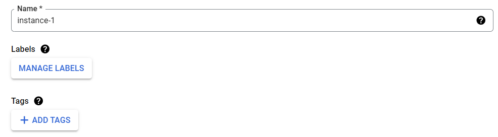

# Google Cloud Platform

Deploying infrastructure utilize Navixy on-premise solution requires thoughtful initial site selection. If you decide to favor a cloud platform, one of the most popular solutions is Google Cloud Platform (GCP). It is a reliable proven and widely recognized platform that allows you to easily launch virtual machines with minimal effort. However, it still provides as much customization flexibility, security, and fault tolerance as other popular platforms.

Below are the very basic steps to deploy a working virtual machine on which you can install the Navixy On-premise solution. If you need to fine-tune your cloud environment and perform more sophisticated settings, you will need to refer to the [Google Cloud documentation](https://cloud.google.com/docs/).

## First steps

The first thing you need to do is sign up for the service, choosing an individual or business account depending on your purposes. If you are registering for the first time, you will have an opportunity to take advantage of a 90-day trial period and $300 credits, so you can do further work without any rush. However, remember that when you are ready to launch your instance as a business-ready solution, you need to convert your account from a free trial to a full account, otherwise you risk losing your instance after 90 days run out.

Once your registration is complete, you will need to select or create your project. By default, a new project is already created, but you can rename it or create another one.

Once the project is created, you can proceed to create your new cloud virtual machine.

## Virtual Machine

To create a new virtual machine, select “Create a VM” option on your project’s dashboard, in the “Products” section.

Another way is to proceed to “Compute Engine” - “VM instances” in navigation menu.

Next, you will be prompted to enable the Compute Engine API - this is a mandatory step to further work with virtual machines.

After the API is enabled, you will be forwarded to **VM instances** menu - this is where you can create your virtual machines.

Click **CREATE INSTANCE**.

Here you need to do the following.

1. Choose a name - it can be any name, but it is desirable that it indicates the purpose of the machine. Optionally, you can assign labels and tags to organize your workspace.\
   
2. Select a region and zone - this means where the data center hosting your future server will be physically located. It is preferable to choose a region as close to your customers as possible. This setting slightly affects the cost.\
   
3. Select machine configuration. In this section you choose your server configuration depending on the tasks and planned loads. You can find more information on possible instance configurations in [Google Cloud Platform documentation](https://cloud.google.com/compute/docs/instances). For high-loaded huge instances, it is recommended to select compute optimized configuration. The type and configuration of the instance greatly affect the cost.\
   
4. Configure boot disk. Here you select the operating system version (Ubuntu 20 or newer is recommended), disk type (SSD is recommended) and disk capacity (must be calculated according to [server hardware requirements](../requirements/server-hardware.md)).\
   
5. Configure firewall settings. Basically you need to have HTTP and HTTPS traffic allowed.\
   
6. Make any other settings based on your specific requirements.
7. Click **CREATE**. Your new cloud instance will be created.

## Connection

Once the virtual machine is created, it will be assigned an internal and external IP address. But even though it has an external address, you will not be able to use it for SSH connection right away.

The cloud instance supports connection using SSH keys, and the easiest way to set up the connection is to provide the server with a key you have on your side.


If you do not have SSH keys on your side, you need to create a neew key using OpenSSH (Linux/MacOS) or PuTTYgen (Windows).


First, you need to establish in-browser SSH connection provided in Google Console. Click “SSH” button to the right of the newly created instance.

A new browser window will open, where a connection to the server will be established. Follow the prompts on the screen - at some point the console will perform authorization. After this, you will be logged into Linux system under your Google username.

Your new user is sudoer and has root privileges, so you can make the necessary settings on its behalf, or run `sudo -i` and perform all further actions as root.

Now you need to select a user for remote SSH access. The system has a default user `ubuntu`, we will configure it using this example, but you can create any user of your choice for this.

Proceed to the file `/home/ubuntu/.ssh/authorized_keys`. If there is no such file or directory, you need to create it first. Open the file for editing. Copy the public part of your SSH key to this file - it must be preceded with `ssh-rsa` and finished by any disambiguative name.

Save the file.

Restart SSH service: `sudo systemctl restart ssh`

Now you can use any SSH client (e.g. PuTTY) to connect to your newly created cloud instance - remember to use your private key for authentication.

## Navixy platform deployment

Now you have a working cloud server that you can access remotely.

Proceed to the relevant section of instructions and perform [Navixy On-premise platform installation](../installation/advanced-installation/).
