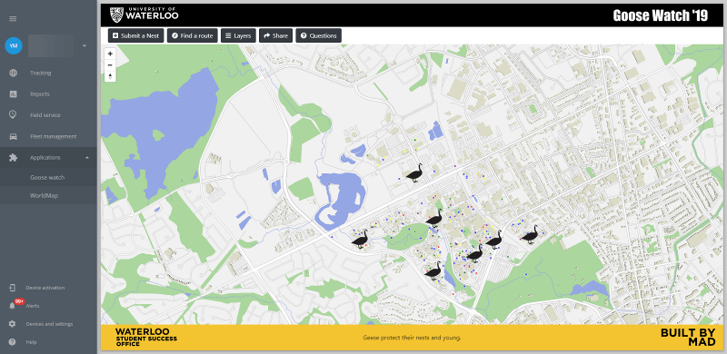

# Applications

In your Navixy instance, you can modify the list of web applications available to your users by adding or removing custom apps to the main menu.


Standard modules, such as Field Service and Fleet Management, cannot be enabled or disabled in the database or in platform configuration files. Their presence in the interface is conditioned by the terms of your instance's tariff plan.


## Embedding custom applications to Navixy

The Navixy platform allows you to integrate your custom web application into the Navixy main application interface. This custom application will appear as a distinct item in the main menu, and upon clicking, it will open a specified external URL address as an internal interface application.



There are several parameters the integration can have:

* _%name –_ application name
* _%link\_to\_the\_app –_ link to the application

To activate an application and make it available for the entire service account or specific users, use the following SQL queries in the database.

**Enabling the app for the entire service account (all users)**


```sql
INSERT INTO google.plugins2dealers (dealer_id, plugin_id, parameters) VALUES (1, 52, '[{"name": "%name","app_page_url": "%link_to_the_app"}]');
```


Change the highlighted parameters in bold to match the name and link to your app.

**Enabling the app to individual user accounts**


```sql
INSERT INTO google.plugins2users (user_id, plugin_id, parameters) VALUES (%user_id, 52, '[{"name": "%name","app_page_url": "%link_to_the_app"}]');

```


In this case, replace %user\_id with the user ID that should have access to this app. If multiple users need access, each user will require their own command.


Note that if you are using an HTTPS connection, your app link must also be HTTPS to avoid a mixed content error. Once you have added the app successfully, it should appear in the Navixy platform menu.

