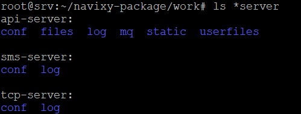

# Dockered solution configurations and logs

Because of the unique nature of the Dockered solution, all services are housed within containers. Consequently, to access a directory with service files, simply navigating to the desired path is insufficient; one must first enter the container itself.

The Navixy Dockered solution was initially crafted with a focus on simplicity and user-friendliness in the installation and maintenance process. As a result, the decision was made to allocate dedicated directories within the main working directory for housing configuration files and logs. This ensures convenient accessibility and ease of use for managing these essential components.

The main directory is specified during the initial Navixy Dockered solution installation in a `WORKDIR` line of `.env` file, and by default it is `.../navixy-package/work/`. Hereinafter we will specify this directory as `WORKDIR`.

Inside you will find many working files, including Java service configs and logs, database files and frontend configs.


To successfully perform the necessary configurations, it is crucial to know the location of the required files. On this page, we provide only the file locations without going into detail about their contents or specific settings. For a comprehensive understanding of the various configurations you need to perform, please refer to the relevant documentation pages.


## Java services

As indicated on [System Components](../../troubleshooting/system-components.md) page, the platform backend consists of three Java services called API-server, SMS-server and TCP-server. Although the services themselves are located inside containers, their service files are stored in `WORKDIR` for easy access.

Each of the Java services has its own directory named accordingly:

* `./api-server`
* `./sms-server`
* `./tcp-server`

Inside of each of these three directories you will find these subdirectories:

* `./conf` - configuration files of the service.
* `./log` - log files of the service.

## Frontend

Admin panel and User interface configurations are also stored in the `WORKDIR`. They are located in `./web/conf` directory.

Inside you will find three files:

* `app_config.js` - user interface settings configuration.
* `Config.js` - user interface main configuration.
* `PConfig.js` - admin panel configuration.


To modify platform configurations, kindly consult the pertinent documentation pages. Should you require any adjustments, the information provided therein will be of great assistance. If you are not sure what configuration changes you need to make, consult [technical support](mailto:support@navixy.com). Please be mindful! Making hasty alterations could render the platform inoperable.

