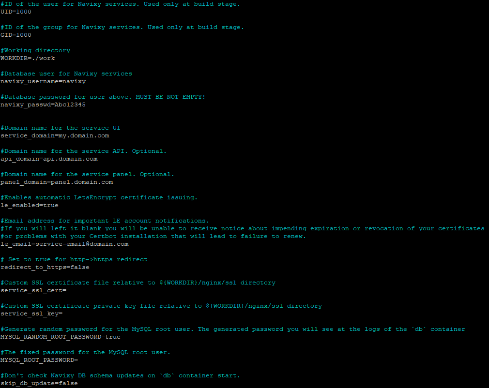

# .env file

To run Navixy platform dockered version, the **.env** file is the primary configuration file. It contains such important parameters as database credentials, domain names, platform installation working folder and others.



The **.env** file is mainly used during the initial installation of the platform. However, if you need to change something in the configuration of an existing platform, you will need to modify this file as well.

All parameters in this file are commented out for a better understanding of what you are dealing with. Additional information on these parameters is described in below sections.


If you change any configuration settings while the instance is already running, the changes are not applied instantly. You need to reinitialize the entire instance for them to take effect. To do this, from the main platform folder (navixy-package), run the command: `docker compose up -d` This will recreate the containers with the new settings.


## UID and GID

These are service parameters only used at the platform build stage. You do not need to change them.

## WORKDIR

This is a parameter that indicates the working directory of the platform - where the database and all service files are stored. It is necessary to secure this directory to avoid loss of business data.

Default value of this parameter: `WORKDIR=./work`.

This means that `/work` directory inside the unpacked Navixy build is used. If the directory does not exist, it will be created.

If necessary, you can place the work directory anywhere on your system. To do this, specify the full path to the directory. Examples:

* `/home/admin/work`
* `/usr/local/navixy`

Be sure to give the directory an obvious name so as not to delete it by mistake.

## navixy\_username

This is the username used for database access. It is always `navixy`, do not change it.

## navixy\_passwd

This is the password for `navixy` database user. By default, this value is empty and you are required to specify the password of your choice. It is recommended to auto-generate a strong password, but the choice is yours, you can specify whatever you want.

Do not change this password after the database is created and the platform is deployed.

## service\_domain

This is the main domain of your platform instance. It is used for:

* Access to the user interface.
* Device activation.

In case you are utilizing a single-domain installation (without separate domains for API and admin panel), this domain will also be used for:

* Access to API by the link `service_domain/api`
* Access to admin panel by the link `service_domain/panel`


This can also be an IP address of you server if you are not going to use domain name for your service.


## api\_domain

This parameter is optional and used only for three-domain installations.

Here you need to specify the domain name used to access API of your platform.

## panel\_domain

This is also the optional parameter used for three-domain installations.

Here you need to specify the domain name used to access the admin panel of your platform.

## le\_enabled

This parameter activates automatic issuance and further reissuance of the Let's Encrypt SSL certificate.

It is `true` by default. This means that when you deploy the platform, the Certbot will be configured and it will handle automatic SSL-certificate issuance for your domains. This way, you won't need to worry about purchasing third-party certificates. The instance will configure itself to be SSL-protected.

If you want to use your own SSL certificate instead of Let’s Encrypt, change this parameter to `false`.

## le\_email

This is the e-mail address to receive information about the operation of the Certbot, such as certificate expiration, certificate revocation, and problems that may lead to the inability to reissue the certificate.

By default, this parameter is empty. It is recommended that you specify a valid email address so that you do not miss important notifications about SSL protection of your website.

## redirect\_to\_https

This setting allows requests to be redirected from _http_ to _https_. If your platform is configured to use SSL protection and someone tries to use a URL starting with _http_, an automatic redirect to _https_ will be triggered.

If the parameter is disabled (false) then no redirection will occur, and the website will not be opened.


This parameter is applicable only if SSL protection is enabled and SSL-certificate is installed.


## service\_ssl\_cert and service\_ssl\_key

If you are not planning to use Let's Encrypt and want to use your own SSL certificate instead, you need to place the certificate for your domain and its private key to the directory: `WORKDIR/nginx/ssl`.


Be sure to switch **le\_enabled** parameter to `false` before applying any changes to this section. You cannot use your own certificates for the platform when certbot is running.


After the certificate and the key are in place, you need to specify their file names for the corresponding parameters of the config. Note that you do not need to specify paths. Example:

```
service_ssl_cert=my_domain_com.crt
service_ssl_key=my_domain_com.key
```

## MYSQL\_RANDOM\_ROOT\_PASSWORD

This parameter enables generation of random password for MySQL `root` user. The default value is `true`.

The parameteris used only during initial database initialization when installing the platform. At further restarts and updates of the platform it does nothing, and the password remains the same.

If you prefer to set a specific MySQL root password, change the value to `false` and proceed to the next parameter.

## MYSQL\_ROOT\_PASSWORD

Here you specify the root password for MySQL.

This parameter is applied only when `MYSQL_RANDOM_ROOT_PASSWORD` is toggled to `false`. Otherwise, the value is ignored.

## skip\_db\_update

This parameter disables updating the database when `navixy-standalone-db` container is started. It is used for testing purposes, you do not need to change the default value (`false`) during regular platform usage.
