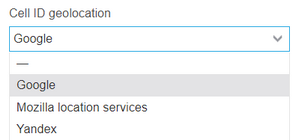
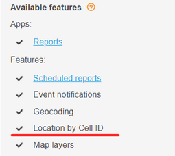

# Cell ID / LBS

This page provides instructions for configuring Cell ID / LBS (location-based services) in the Navixy On-Premises solution. To learn more about what this feature is used for and how it can be configured in the user interface, please refer to the corresponding page in the user manual.

## Configuring Cell ID / LBS function

Since all location-based services (LBS) operations are performed by the TCP server, the activation and configuration of this function is performed in the configuration file for the TCP server service, located at `/home/java/tcp-server/conf/config.properties` (for Linux deployments).

### Enabling Cell ID / LBS function

In order to enable the LBS feature, the configuration file must include the following parameter:

```
geocodingService.lbs.enabled=true
```

Depending on the version of the Navixy platform and its previous configurations, this parameter may be absent or set to false. If the parameter is missing, it can be added as a separate line at the bottom of the configuration file.

### Update interval

Navixy platform sends requests to the LBS service every 20 minutes by default, in cases where the GPS signal has not been updated. However, this interval can be adjusted by adding the following parameter to the configuration file (the value is specified in minutes and can be customized to suit your needs):

```
geocodingService.lbs.delay=15m
```

Once the configuration has changed the _tcp-server_ must be restarted to apply the new settings.

## LBS databases

Navixy platform offers two options for location-based services (LBS): Mozilla Location Services (MLS) and Google LBS. This is defined by the parameter `lbs.service_url` in the tcp-server configuration file `/home/java/tcp-server/conf/config.properties` (for Linux deployments).

**Option 1. Mozilla Location Services (MLS)**

```
lbs.service_url=http://location.services.mozilla.com/v1/geolocate?key=test
```

**Option 2. Google LBS**

```
lbs.service_url=https://www.googleapis.com/geolocation/v1/geolocate?key=YOUR_API_KEY
```

### Mozilla Location Services (default)

By default, Navixy uses the Mozilla Location Services, which is an open public geolocation service that anyone can use to process LBS requests and obtain LBS data. While the performance of MLS is generally sufficient, its accuracy and stability cannot be guaranteed.

In some cases, MLS may not return the coordinates due to high load on the service or a lack of information in its database. Unfortunately, there is no way to influence the operation of the service.

If you frequently encounter the problem described above, or if MLS performance is insufficient in your country and LBS is critical for you, you can opt for Google LBS service. This is a commercial service that provides performance guarantees.

### Google LBS

To configure Google LBS operation on the platform, you need to do the following steps:

1. Contact Google to purchase the API key required for LBS.
2. Add this key to the _api-server_ configuration: `/home/java/api-server/conf/config.properties`(Linux). You need to add the following parameter to the configuration (replace KEY with your key):

```
lbs.google.apiKey=KEY
```

3. Go to the admin panel, open _Account management → Service preferences_, and select Google in _"Cell ID geolocation"_.



4. Make sure that "Location by Cell ID" is selected in the tariff plan settings for the devices.




Please note that Google charges a fee for every LBS request. With a large number of devices sending LBS data, using this service can be quite expensive. You can reduce costs by limiting the use of this service to specific devices only. To do this, create a plan with the "Location by Cell ID" option enabled, disable this option for all other plans, and then assign this plan to the necessary devices.Requests to LBS service are performed only for those devices for which the option is active. If the option is not enabled for a plan, LBS data will not be processed even if the device sends it

