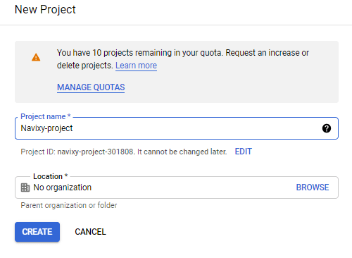

# Google Карты и геокодирование

Чтобы использовать **Google Maps** в платформе **ГдеМои — Локальная версия**, необходимо получить действительные ключи API Google Maps.  
Данная инструкция описывает процесс их создания и применения в конфигурации платформы.

Руководство поможет вам:

* настроить аккаунт в **Google Cloud Console**;
* создать новый проект;
* сгенерировать необходимые ключи API;
* применить их в настройках платформы **ГдеМои**.

После выполнения шагов вы сможете интегрировать Google Карты и использовать все возможности продвинутой картографии и геокодирования.

---

## Создание ключей Google API

Для корректной работы платформы требуется несколько ключей Google API.  
Обратите внимание, что ключи привязываются к вашему аккаунту и подчиняются политике использования Google API.

Полезные ссылки:

* [Условия использования Google Maps APIs](https://developers.google.com/maps/terms)
* [FAQ Google Maps](https://developers.google.com/maps/faq)

---

### Настройка аккаунта и проекта

1. Перейдите на страницу [Google Cloud Console](https://console.cloud.google.com/projectselector2/apis/dashboard?supportedpurview=project) и войдите в систему под своей учётной записью Google.  
   Если аккаунта нет — создайте его.
2. Ключи API создаются внутри проекта.  
   Если проект уже существует, выберите его из списка.  
   Если нет — нажмите **Create project**.
3. Назовите проект и нажмите **Create**, чтобы его создать.




4. Убедитесь, что выбран созданный проект, и нажмите **Enable APIs and Services**.  
   Откроется библиотека API.
5. Введите название нужного API, выберите его и нажмите **Enable**.  
   Для карт в интерфейсе используйте **Maps JavaScript API**.
6. Повторите процесс для остальных API, необходимых платформе.  
   Всего требуется 5 API:

* Google Maps JavaScript API — карты в интерфейсе;
* Google Maps Geocoding API — геокодирование;
* Google Maps Geolocation API — обработка LBS-данных;
* Google Maps Directions API — построение маршрутов;
* Google Static Maps API — статические карты в письмах.


После включения убедитесь, что все API отображаются в вашей панели управления:


---

## Генерация ключей Google API

Для полной функциональности платформы потребуется **три ключа API**:

1. Ключ № 1 — для отображения карт в интерфейсе.  
2. Ключ № 2 — для работы геокодирования, маршрутов и LBS.  
3. Ключ № 3 — для статических карт в email-уведомлениях.

---

### Ключ № 1 — для карт в интерфейсе

1. Откройте вкладку **Credentials**.  
2. Нажмите **Create credentials → API key**.  
3. Ключ появится в новом окне.  
4. Нажмите **Restrict key** для настройки ограничений.  
5. Укажите понятное имя ключа.  
6. В разделе **Application restrictions** выберите **HTTP referrer** и добавьте ваши домены, например:  
   `https://contoso.com/*`, `https://gps.contoso.com/*`.  
7. В разделе **API restrictions** выберите **Restrict key** и отметьте **Maps JavaScript API**.  
8. Сохраните изменения.


---

### Ключ № 2 — для геокодирования, маршрутов и геолокации

1. Перейдите во вкладку **Credentials**.  
2. Нажмите **Create credentials → API key**.  
3. В новом окне нажмите **Restrict key**.  
4. Укажите имя ключа.  
5. В разделе **Application restrictions** выберите **IP addresses** и укажите публичный IP-адрес сервера.  
6. В разделе **API restrictions** выберите **Restrict key** и отметьте:  
   * Maps Geocoding API  
   * Maps Geolocation API  
   * Maps Directions API  
7. Сохраните изменения.


---

### Ключ № 3 — для статических карт в уведомлениях

1. Перейдите во вкладку **Credentials**.  
2. Нажмите **Create credentials → API key**.  
3. Нажмите **Restrict key** для редактирования.  
4. Укажите имя ключа.  
5. В разделе **Application restrictions** выберите **HTTP referrer** и укажите домены, например:  
   `https://contoso.com/*`, `https://gps.contoso.com/*`.  
6. В разделе **API restrictions** выберите **Restrict key** и отметьте **Maps Static API**.  
7. Сохраните изменения.


---

### Получение URL Signing Secret

Для третьего ключа (Static Maps) потребуется **секрет подписи URL**.  
Чтобы его получить:

1. Перейдите на **Dashboard**.  
2. В списке API выберите **Maps Static API**.  
3. Откроется новая страница.  
4. Перейдите в меню **Credentials**.  
5. Убедитесь, что выбран **Maps Static API**.  
6. Пролистайте вниз до раздела **URL signing secret** — здесь отображается текущий секрет.


---

## Применение ключей Google API

Рекомендуется использовать три ключа с распределением по функциям:

**Ключ № 1** — ограничен по HTTP referrer (домен пользовательского интерфейса):  
* Maps JavaScript API  
* Street View Image API  

**Ключ № 2** — ограничен по IP-адресу сервера:  
* Maps Geocoding API  
* Maps Geolocation API  
* Maps Directions API  

**Ключ № 3** — ограничен по HTTP referrer (домен интерфейса):  
* Maps Static API  
* Требуется URL signing secret  

---

Все три ключа необходимо сохранить в базе данных.  
Используйте таблицу **google.dealer_service_credentials** и выполните запрос:

```
INSERT INTO dealer_service_credentials (dealer_id, service_type,credentials) VALUES (1, 'google', '{"maps_js_api_key":"FIRST_KEY_HERE","server_api_key":"SECOND_KEY_HERE","static_map_api_key":"THIRD_KEY_HERE", "static_map_crypto_key":"URL_SIGNING_SECRET_HERE"}';
```

Если вы используете только один из ключей, можно добавить только его, например:

```
INSERT INTO google.dealer_service_credentials (dealer_id, service_type, credentials) VALUES (1, "google", '{"static_map_api_key":"THIRD_KEY_HERE", "static_map_crypto_key":"URL_SIGNING_SECRET_HERE"}');
```

---

## Завершение настройки

После добавления ключей необходимо перезапустить сервисы платформы командой:
```
restart-navixy
```
