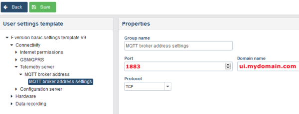
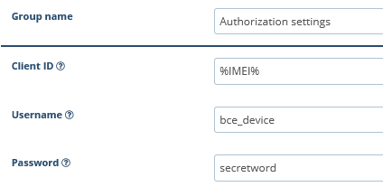
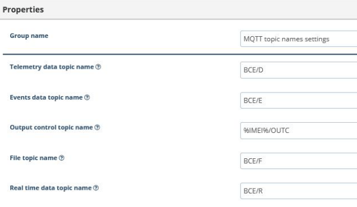
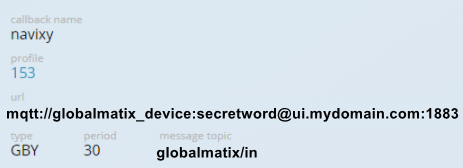

# MQTT

MQTT is a popular communication protocol used for Internet of Things (IoT) devices. It enables devices to send and receive messages with low latency and bandwidth usage, making it ideal for IoT applications.

Navixy users can easily utilize the MQTT protocol to connect their IoT devices to the platform and receive real-time data without requiring any special configuration. This feature is available across all Navixy deployment types, including ServerMate (PaaS), Cloud, and On-Premise. With MQTT, users can also send commands to the devices and monitor their status, providing a powerful tool for managing IoT devices.

## Examples of configuring MQTT devices

The following are examples of MQTT device configuration for specific devices:

* [Xirgo Global (formerly BCE)](mqtt.md#xirgo-global)
* [Globalmatix](mqtt.md#globalmatix)

The process of adding MQTT devices to the Navixy platform is identical across all Navixy deployments, including ServerMate (PaaS) and On-Premise. However, the device setup process may differ slightly. Examples are provided below for reference.

### Xirgo Global

To configure Xirgo Global devices to work via MQTT:

1. Log into [BCE configuration manager FMSET](https://xdm.xgfleet.eu/login)
2. Choose Connectivity → Telemetry server → MQTT broker address settings and specify:

* Host: your host for Navixy User Interface (e.g. [ui.mydomain.com](http://ui.mydomain.com))
* Port: 1883

3. Add the default user in MQTT Security -> Authorization

* Client ID: %IMEI%
* Username: bce\_device
* Password: secretword

4. Check that your topic configuration is correct:

* All topics except for Output control topic name are set to default values
* Output control topic name must be set to %IMEI%/OUTC

5. Save your configuration

### Globalmatix

To configure the Globalmatix device to work via MQTT:

* Specify your host for Navixy User Interface (e.g. [ui.mydomain.com](http://ui.mydomain.com))
* Port: 1883
* User: globalmatix\_device
* Password: secretword
* Topic: globalmatix/in

