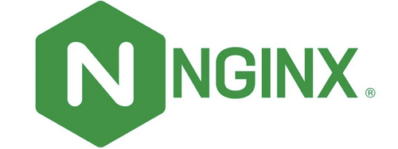

# Nginx web server

Nginx is the web server used by Navixy platform to run the website. It is freeware designed to run on Linux and is also compatible with Windows.

<div align="center"></div>

Nginx is used for both Navixy On-premise solution and Navixy PaaS servers. It is the only type of web server that is guaranteed to be compatible with the platform. No other web servers (Apache, IIS, etc.) are supported.


If you have other web applications installed on your server alongside Navixy On-premise, you can utilize different web server software concurrently with Nginx for those products. In this situation, it is crucial to perform port separation for these web servers to prevent port conflicts on the same ports.


## Nginx configurations

Using a web server means configuring it so that your website works as intended. The configuration specifies such important things as:

* Domain(s) of your website
* Protocol (HTTP/HTTPS)
* SSL certificates
* The location of the website content

And other parameters necessary for the proper functioning of the web page.

### Linux configurations

The current version of Navixy On-premise platform is installed on Linux automatically, either using auto-install scripts or by deploying docker containers. In both cases, the Nginx configuration is done automatically during installation and you don't need to make any changes to it, and it is fully prepared for further work.

If your instance was deployed in manual mode in the past, the previously made configs remain fully functional and do not need to be modified, unless you are going to apply some fundamental changes to the website (e.g. change the domain or enable/disable SSL). If any modifications are required, please contact [Navixy technical support](mailto:support@navixy.com) for further instructions.

### Windows configurations

In the case of Windows, all installation and configuration of Navixy On-premise platform is done manually and there is no automation. Therefore, Nginx must also be configured manually.

To make the setting process easier, configuration templates are provided, which are usable after simply replacing variables with the actual values of the domain and SSL certificate names.

The templates are located in `\windows\nginx` folder of `navixy-package` (unpacked distribution build of Navixy On-premise platform). The files are:

* `navixy.conf` - configuration file for the platform website opened on HTTP, without SSL protection.
* `navixy_ssl.conf` - configuration file for SSL-protected website.

Choose the file according to how you plan to set up the website.


Variable values are specified with a dollar sign and in curly braces - these characters identify the variable. For example:\
`${service_domain}`\
When replacing the variable with the real value, these characters must be removed. For example:\
`${service_domain}` becomes `my.domain.com`


#### HTTP, no SSL protection

This is the easiest option for setting up Navixy platform website, you only need a registered domain(s) pointing to your server.

Edit the file `navixy.conf` located in `C:\nginx\conf\conf.d`. Replace the following values:

* `${service_domain}` - user interface domain in three-domain installation or the main domain of your platform in a single-domain installation.
* `${api_domain}` - the domain for API in three-domain installation. For a single-domain installation, delete the variable but preserve the rest of the line.
* `${panel_domain}` - the domain for admin panel in three-domain installation. For a single-domain installation, delete the variable but preserve the rest of the line.

Save the file and restart Nginx. Your Navixy website must be available on the specified domain(s).

In case of one-domain installation, the admin panel will be available on `/panel` path (e.g. `http://my.domain.com/panel`), and API will be available on `/api` path (e.g. `http://my.domain.com/api`).

#### HTTPS, SSL-protected

To set up an SSL-secured website, you need not only a registered domain, but also a valid SSL certificate and its private key.


For more information about SSL certificates, please check [the corresponding page](ssl-certificates/ssl-certificates-installation.md) of the instructions.


Place SSL certificate(s) and private key(s) in `C:\nginx\ssl` folder. Create it if it does not exist.

Edit the file `navixy_ssl.conf` located in `C:\nginx\conf\conf.d`. Replace the following values:

* `${service_domain}` - user interface domain in three-domain installation or the main domain of your platform in a single-domain installation.
* `${api_domain}` - the domain for API in three-domain installation. For a single-domain installation, delete the variable but preserve the rest of the line.
* `${panel_domain}` - the domain for admin panel in three-domain installation. For a single-domain installation, delete the variable but preserve the rest of the line.
* `${certificate_name}` - name of the certificate file with extension. Must be the certificate issued for the domain.
* `${private_key_name}` - name of the private key file with extension. The key must match the certificate.

Save the file and restart Nginx. Your Navixy website must be available on the specified domain(s).

In case of one-domain installation, the admin panel will be available on /panel path (e.g. `https://my.domain.com/panel`), and API will be available on /api path (e.g. `https://my.domain.com/api`).

#### HTTP-HTTPS redirection

When you use HTTPS, you may want your users to be able to get to the platform even if they open the address via HTTP. To do this, you need to have `navixy.conf` (HTTP config) applied along with `navixy_ssl.conf` (HTTPS config).

Configure `navixy.conf` as specified above in **“HTTP”** section and then uncomment the following line (delete `#` character):

```
#return 301 https://$host$request_uri;
```

Save the file and restart Nginx to apply changes. Now, HTTP requests will be redirected to HTTPS.
