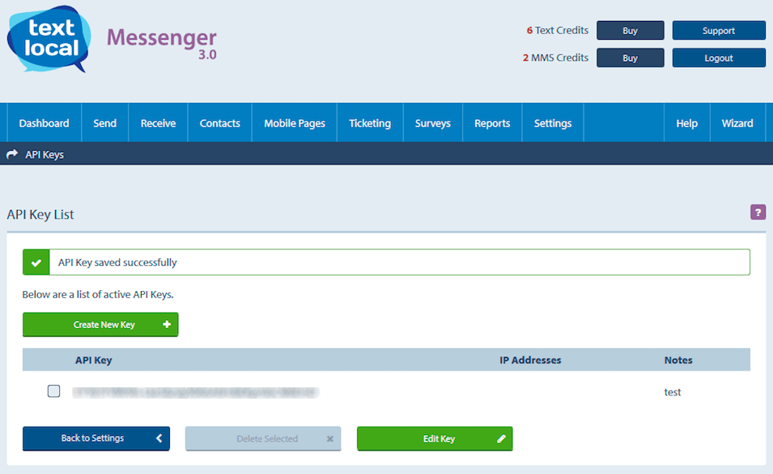

# Textlocal

[Textlocal](http://www.textlocal.com/) is a cloud-based SMS messaging platform that enables businesses to send and receive text messages. The company is based in the UK and operates globally.

## Navixy JSON configuration for Textlocal

To use Textlocal with Navixy, you need to create a Textlocal account and obtain their API key and API secret, which are unique to their Textlocal account and used for authentication. These credentials must be included in the JSON configuration for the Textlocal gateway in the **'sms\_gates'** table of the **'google'** database.

```json5
 {
 "username": "user@domain.tld",
 "hash": "your-secure-hash",
 "enable_status_callback": false
 }
 type: transceiver
 provider: textlocal

```

where `hash` - secure hash can be found in the Messenger item in the main menu.

Alternatively, you may use API key from Textlocal:

```json5
 {
 "api_key": "your-api-key",
 "enable_status_callback": false
 }
 type: transceiver
 provider: textlocal
```

where `api_key` is the API key created in your [Messenger Control Panel](https://control.txtlocal.co.uk/settings/apikeys/):



If you use Textlocal in India ([textlocal.in](http://textlocal.in/)) you need to add the `URL` parameter:

```json5
 {
 "url": "http://api.textlocal.in/send/",
 "api_key": "your-api-key",
 "enable_status_callback": false
 }
```

The resulting SQL query to create sms gate in Navixy system will be as follows:


```sql
INSERT INTO google.sms_gates (type, provider, params, enabled, class_filter) VALUES ('transceiver', 'textlocal', '{"api_key":"your-api-key"}',1,'*');
```


## **Sender phone number**

To update the phone number that should be used for the sender:


```sql
UPDATE google.dealers SET master_phone = "TEXTLOCAL_PHONE", from_sms="TEXTLOCAL_PHONE" WHERE dealer_id=1;
```


In the request shown above you should insert your Textlocal phone number instead of `TEXTLOCAL_PHONE`. If you are writing a script, you should escape all backticks.

## **Incoming messages**

You can configure any of your Textlocal inboxes to send a notification to a URL whenever you receive a message. This is perfect for two-way communication via your website or application. To enable message notifications, simply enter your URL into the relevant inbox settings within Messenger:

`http://$IPADDR:22000/sms/$GATEID/incoming`

Where:

* `$IPADDR` – is an ip address of the server or its domain name
* `$GATEID` - id of sms gate which is processing incoming messages
* `22000` - port used to listen connects(default value)

For more information please refer to the Textlocal [docs](https://control.txtlocal.co.uk/docs/)
