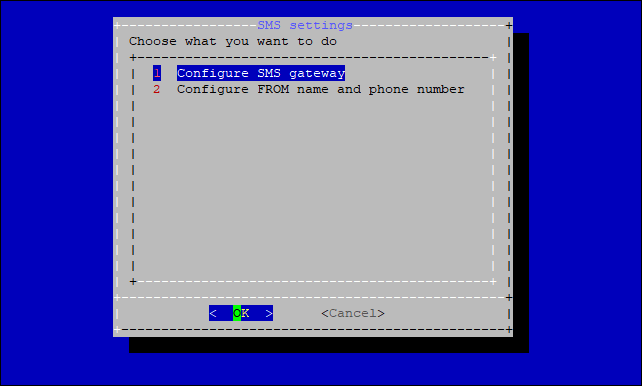
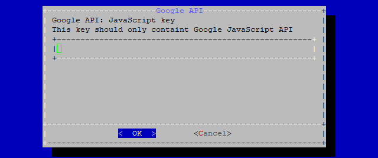

# Configuration wizard

The Navixy platform offers a configuration wizard that users can utilize to configure the platform initially or modify some common settings. While all the settings described below can be directly applied to the database and service configurations, doing so can be risky if not handled with care. To avoid any potential risks, it is strongly recommended to use the configurator.


Configuration wizard can only be used for Navixy instances deployed with installation script on Ubuntu. This wizard is not applicable for other deployment methods.


## Launching configuration wizard

To run the wizard, go to the `/navixy-package` directory and run **./configure.sh**

You will be greeted by the main menu:

Below is the explanation of each menu and sub-menu:

## 1. Domain name and SSL settings

### 1.1. Domain names

The only option here is to change domain names and SSL.


Domain names and SSL certificates are specified during the initial installation. However, there can be situation when you need to change some of those for an existing platform.


The Configuration Wizard allows you to perform configuration with either a single domain name for the entire platform or with three domain names - separate for API, for admin panel and for the user interface.

In the case of a **single domain name**, you only need to specify the domain for your service in the first step, leave the other two domains blank. In this case, the API and admin panel will be configured as subdirectories (this is made automatically). Examples:

* [my.domain.com/api](http://my.domain.com/api)
* [my.domain.com/panel](http://my.domain.com/panel)

If you are performing a **three domain names** configuration, you need to specify sequentially:

* Service domain (used for user interface and device activation). E.g.: [my.domain.com](http://my.domain.com)
* API domain (used for all API operations). E.g.: [api.domain.com](http://api.domain.com)
* Admin panel domain (used to access Admin panel). E.g.: panel.domain.com

Once all domains are specified, the wizard will show you the results of your configuration. If you need something to be changed, run the wizard once again

You can learn more information about domain names at this page: [Domains](../../../requirements/domains.md)

### 1.2. SSL certificates

After the domain names are configured, you will see an SSL certificate install menu.


If you don't intend to use SSL at all, just select **No** and the script will terminate, saving only the domain name configuration.


If you select **Yes**, your platform will be configured to use HTTPS.

Next, the script will ask you whether you are going to use free Letsencrypt SSL certificates, or you want to use your own certificates.

#### Let's Encrypt free certificate

Select **Yes** to install free Let's Encrypt SSL certificates for your domains. This will also set up auto-renewal of certificates so you don't have to renew them manually.

The script will install the software needed to issue the certificate (this may take some time).

You will be be prompted to specify your email address. This is not necessary but recommended.

The script will automatically recognize domain names (taking them from configs), generate and install certificates. After that the script will terminate.

Now you have configured domain names, and your website is SSL-protected.

#### Your own SSL certificate

Selecting the **No** option in response to the question about Let's Encrypt SSL certificates will take you to the menu for installing your own SSL certificates. To proceed, you must have a valid full-chain certificate as well as its private key. Place them somewhere on your server. The standard location is `/etc/nginx/ssl`.

First you need to specify a path to the certificate file:

Next, specify the path to the private key file of your SSL certificate:

The paths to your certificates will be inserted to Nginx configuration.

Certificates are now installed, and your domains are SSL-protected.

## 2. SMS settings

Here you can apply settings of your SMS-gateway, and also specify credentials of service SMS sender.

### 2.1. Configure SMS gateway

The first option in this menu allows you to disable the SMS gateway if you already have one set up and no longer need to use it.

The other options allow you to apply settings for a specific SMS gateway service provider.

The last option allows you to connect the SMS gateway via SMPP protocol. This option is also suitable if your gateway provider is not on the list, but it supports SMPP on its side.

You can learn more about SMS gateways on the page [Messaging gateways](https://app.gitbook.com/s/KdgeXg71LpaDrwexQYwp/settings/messaging-gateways).

### Configure 'from name' and 'sender phone number'

In this menu you can specify the number and name of the sender of service SMS messages, if necessary.

## 3. Email gateway settings

Here you can configure only feedback email settings. **Please note:** Main email gateway settings are configured from the admin panel ([Messaging gateways](https://app.gitbook.com/s/KdgeXg71LpaDrwexQYwp/settings/messaging-gateways)).

The script will ask you to specify the email address to receive user feedbacks from a help section (TO email address).

Then you will be asked about user email substitution.

Select **YES** to use the email address of the user to send feedback requests.

Select **NO** to replace the sender's email address with a specific one. In this case, the script will ask you to specify this email address (FROM email address).

## 4. Google Maps API settings

Here you can specify the Google maps API key if you did not purchase the Premium GIS package from Navixy, but preferred to use the key you purchased yourself ([GIS](../../../requirements/gis.md))

First, you need to specify Google API JavaScript key (required for maps availability).

Next, apply Google API server key (required for geocoding operations).

## 5. Navixy License Key

This section contains two options.

### 5.1. Change license key

Here you can specify the license key for your On-premise instance. The license key is applied during the initial installation of the platform, or if it is lost or corrupted for some reason (usually a consequence of tampering with the database). The license key is issued and provided by technical support.

After selecting this option, you will see a warning that changing the license key carelessly may cause the platform to become inoperable.

After that you need to apply the license key you received. This is a rather long combination of characters, so it can be quite difficult to enter manually. You can paste the key from a clipboard by using `Shift+Insert` combination. Alternatively, you can hold `Shift` and use `mouse right click`.

The key will be inserted into the database, and your instance will have a valid license.

### 5.2. Request trial key

This option can only be used to get a one-time trial key. The key is valid for 30 days. Do not use this option if you already have a valid key.

* You cannot re-issue or renew the trial key in this way.
* You cannot restore a lost key in this way.
* You cannot restore a disabled license in this way.

After your trial is expired and you want to continue using your On-premise instance, please contact our customer success team for the commercial license key.

## 6. Plugin settings

Plugins allow to modify or enable various functions of the platform. Since the configurator is designed for basic platform configuration, you can only find three plugins in this menu.

### 6.1. Activation code settings

Here you can enable or disable the use of mandatory activation codes for device registration. If the "Mandatory" option is enabled, users will not be able to register a device without an activation code.

### 6.2. Custom logo settings

Here you can set up a special logo for an individual user.

**Please note**: the logo for the entire platform is customized in the admin panel.

The configuration wizard will ask you to specify the user ID (it can be found in the admin panel or in the user interface)

Next, you need to specify a link to the user's logo. It can be located on an external resource, or locally on the server in a website directory. The logo must be in PNG format, recommended size is 400x400.

The logo will be applied to user’s interface and to reports.

### 6.3. Help section settings

Here you can choose whether to hide or show help section in the user interface (it is shown by default). Help section leads to Navixy website, so its disabling may be useful for white labeling.

## 7. File storage settings

This section allows you to enable and disable file storage.

It is used to store file and image attachments to the task forms and maintenance works. The default directory for storing files is `/home/java/api-server/files`_._
