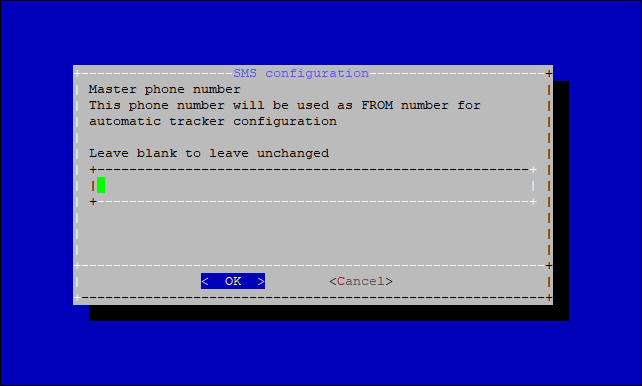
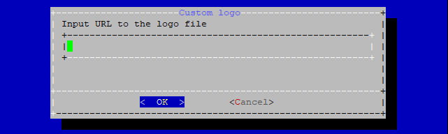

# Мастер конфигурации

Платформа **ГдеМои – Локальная версия** предоставляет мастер конфигурации, который можно использовать для первичной настройки системы и изменения основных параметров.  
Все описанные ниже настройки можно внести напрямую в базу данных и конфигурации сервисов, однако ручное редактирование параметров может привести к ошибкам. Чтобы избежать возможных проблем, **настоятельно рекомендуется** использовать мастер конфигурации.

Мастер конфигурации доступен **только** для платформы, развёрнутой установочным скриптом на **Ubuntu/Debian**. Для других способов развёртывания мастер неприменим.

## Запуск мастера конфигурации

Перейдите в директорию `/navixy-package` и выполните команду **./configure.sh**:

```
cd /navixy-package
./configure.sh
```

Вы увидите главное меню:


Ниже приведены пояснения к разделам меню и их подпунктам.

---

## 1. Домены и SSL

### 1.1. Доменные имена

В этом разделе можно изменить доменные имена и параметры SSL.
Домены и SSL-сертификаты задаются на этапе первоначальной установки. Тем не менее бывают ситуации, когда требуется изменить эти параметры для уже работающей платформы.
Мастер позволяет настроить как **однодоменную** схему для всей платформы, так и **трёхдоменную** — отдельные домены для API, панели администратора и пользовательского интерфейса.

Для **однодоменной** конфигурации укажите домен сервиса на первом шаге, остальные два поля оставьте пустыми — в этом случае **API** и **панель администратора** будут автоматически доступны как подкаталоги. Примеры:

* [my.domain.com/api](http://my.domain.com/api)
* [my.domain.com/panel](http://my.domain.com/panel)

Для **трёхдоменной** конфигурации последовательно укажите:

* Домен сервиса (используется для пользовательского интерфейса и активации устройств), например: [my.domain.com](http://my.domain.com)  
* Домен API (для всех API-операций), например: [api.domain.com](http://api.domain.com)  
* Домен панели администратора (для доступа к панели администратора), например: `panel.domain.com`


После ввода доменов мастер покажет сводку конфигурации. При необходимости повторно запустите мастер и скорректируйте параметры.


Подробнее о доменах см. раздел: [Доменные имена](../../../requirements/domains.md)

### 1.2. SSL-сертификаты

После настройки доменов отобразится меню установки SSL-сертификатов.


Если вы не планируете использовать SSL, выберите **No** — скрипт завершит работу, сохранив изменения доменных имен.

При выборе **Yes** платформа будет настроена на работу по **HTTPS**.

Далее мастер предложит выбрать: использовать **бесплатные сертификаты Let’s Encrypt** или установить **собственные** сертификаты.


#### Бесплатный сертификат Let’s Encrypt

Выберите **Yes**, чтобы установить бесплатные сертификаты Let’s Encrypt для ваших доменов.  
Автопродление будет настроено автоматически.

Скрипт установит необходимое ПО для выпуска сертификатов (это может занять некоторое время).

Укажите email — это необязательно, но рекомендуется.


Мастер автоматически подставит доменные имена из конфигурации, выпустит и установит сертификаты, после чего завершит работу.

#### Собственный SSL-сертификат

Если вы выберете **No** на вопрос об использовании Let’s Encrypt, откроется меню установки **собственных сертификатов**.  
Потребуются валидный сертификат **с полной цепочкой доверя** и соответствующий **приватный ключ**. Разместите их на сервере, стандартный путь: `/etc/nginx/ssl`.

Сначала укажите путь к файлу сертификата:


Затем укажите путь к приватному ключу:


Указанные пути будут внесены в конфигурацию **Nginx**.

---

## 2. Настройки SMS

В этом разделе можно применить настройки вашего **SMS-шлюза**, а также указать параметры отправителя SMS.


### 2.1. Конфигурация SMS-шлюза

Первая опция позволяет **отключить** имеющийся SMS-шлюз, если он у вас настроен.

Другие пункты меню дают возможность применить настройки совместимых SMS-шлюзов.

Последняя опция — подключение по протоколу **SMPP**. Подходит также, если вашего провайдера нет в списке, но он поддерживает **SMPP v3.4**.


### Настройка имени отправителя и номера

Здесь можно указать **номер** и **имя отправителя** для сервисных SMS.




---

## 3. Настройки почтового шлюза

В этом разделе настраиваются **адреса для обратной связи**.  
**Обратите внимание:** основные параметры почтового шлюза задаются в **панели администратора**: [Messaging gateways](https://app.gitbook.com/s/KdgeXg71LpaDrwexQYwp/settings/messaging-gateways).

Скрипт попросит указать email для приёма обращений из раздела «Помощь» (TO email).


Затем потребуется выбрать, использовать ли **email пользователя** как адрес отправителя.


Выберите **YES**, чтобы использовать адрес пользователя.  
Выберите **NO**, чтобы подставлять **фиксированный адрес** — тогда мастер запросит его (FROM email).


---

## 4. Настройки Google Maps API

Если вы не приобретали пакет **Премиум ГИС** и используете собственные ключи Google, укажите ключи здесь ([ГИС](../../../requirements/gis.md)).


Сначала укажите **JavaScript API key** (обязателен для загрузки карт):


Затем укажите **Server API key** (используется для геокодирования):


---

## 5. Лицензионный ключ

В разделе доступны две опции.


### 5.1. Сменить лицензионный ключ

Здесь можно указать ваш лицензионный ключ.  
Ключ применяется при первичной установке или повторно, если он был утрачен (например, вследствие некорректных правок БД).  
Ключ выдаётся **отделом технических решений**.

После выбора опции отобразится предупреждение: неосторожная смена ключа может привести к неработоспособности платформы.


Укажите ваш ключ. Это длинная последовательность случайных символов — для вставки используйте `Shift+Insert` или зажатый `Shift` + **правый клик мышью**.


Ключ будет записан в базу данных, платформа получит валидную лицензию.

### 5.2. Запросить тестовый ключ

Эта опция выдаёт **одноразовый тестовый ключ** на **30 дней**.  
Не используйте её, если у вас уже есть действующий ключ.


* Повторно оформить или продлить тестовый ключ нельзя.  
* Восстановить утерянный ключ таким способом нельзя.  
* Включить отключённую лицензию таким способом нельзя.

По окончании тестового периода для продолжения работы обратитесь в **отдел технических решений** за коммерческим ключом:  
**solutions@gdemoi.ru**

---

## 6. Настройки плагинов

Плагины позволяют модифицировать или включать отдельные функции платформы.  
Так как мастер рассчитан на базовую конфигурацию, в меню доступны три варианта.


### 6.1. Коды активации

Включает/отключает обязательное использование **кодов активации** при регистрации устройства.  
Если опция «Mandatory» включена, пользователи не смогут зарегистрировать устройство без кода.


### 6.2. Индивидуальный логотип

Позволяет задать **особый логотип** для отдельного пользователя.

**Важно:** логотип всей платформы настраивается в **панели администратора**.

Мастер попросит указать **ID пользователя** (его можно посмотреть в панели администратора или в пользовательском интерфейсе).


Затем укажите ссылку на логотип (внешний ресурс или локальный файл на сервере).  
Формат — **PNG**, рекомендуемый размер — **400×400**.



Логотип появится в интерфейсе пользователя и в отчётах.

### 6.3. Раздел «Помощь»

Позволяет скрыть или показать раздел «Помощь» в пользовательском интерфейсе (по умолчанию включён).  
Раздел ведёт на сайт ГдеМои, поэтому его отключение может быть полезно для брендинга.


## 7. Хранилище файлов

Этот раздел позволяет настроить **файловое хранилище**.


Хранилище используется для вложений (файлы и изображения) в формах задач и работ по обслуживанию.  
Каталог по умолчанию: `/home/java/api-server/files`.
