# Installation wizard

The steps for installation will vary based on whether you plan to use an all-in-one server (generally used for small instances) or a separate server for the application and the database (big instance with over 1000 devices). Please select the appropriate section below based on your installation type.

The installation requires Navixy platform distribution package. It can be downloaded directly to the server using the following command:

```
wget --content-disposition https://get.navixy.com/latest
```

After the package is downloaded, you can proceed with the installation.

## Option 1. All-in-one server

First, unpack the Navixy platform build provided as a `tar.gz` archive. Go to the directory with the archive and run the following command for unpacking it (of course replace **\<PACKAGE\_NAME>** with the actual file name):

```
tar -zxvf <PACKAGE_NAME>.tar.gz
```

The archive will be extracted to `/navixy-package` directory. Then, open this directory and run the installation script from it:

```
./install.sh
```

The script will check the OS compatibility and other pre-requisites. No action is needed from you a this stage.

### Select the server role

You will be asked to select the server role for further deployment. You need to select **Single server - all services in one server**. Be careful not to click other options as they are supposed to be used for two-server deployment.

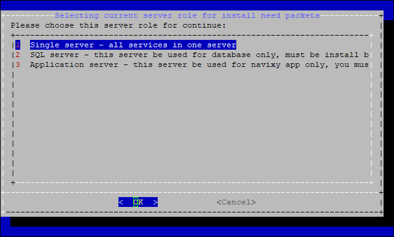

### Installation process

The script will make a software check. You will see that the software is being installed, including Java, Nginx and MySQL. You will see a request to restart MySQL, confirm this by entering `1`. Next, you will be asked to confirm databases initialization, answer affirmative again by entering `y`.

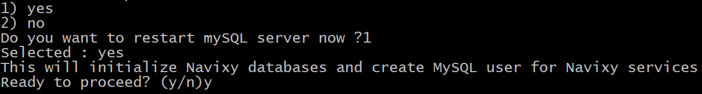

MySQL will ask you to specify the root password. It is not mandatory for the platform so you can leave it blank. If you specify any, be sure to remember it. Next, the script will create databases and the DB user _navixy_ with random password. This will be the main user for the platform services to interact with the database. However, you do not need to remember its password as it will be automatically inserted into the configuration files. After this is done, the script will populate the database with system tables.

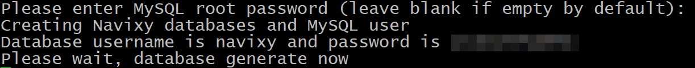

After the database initialization, the script will ask the following:

```
This script will install Navixy platform on this server. Continue? (y/n)
```

Answer affirmative with `y`, and it will do the following:

* Create user for Java services (backend)
* Make the Java services directories and populate them with the required files
* Copy and configure web components (frontend)
* Copy runit scripts required for running Java services
* Configure Java services

### Domains

The script will ask you to specify a domain name for your service. This is a domain used for:

* All the system services in one-domain installation.
* User interface and devices activation in three-domain installation.

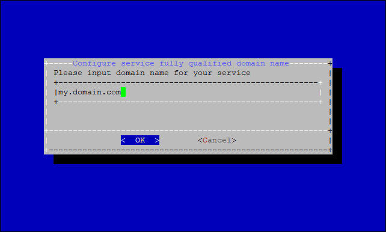

Next, you will be asked for API and Admin panel domains.

* For one-domain installation, leave these values blank and press Enter (OK).
* For three-domain installations, specify API and Panel domains accordingly.


You will see a notification about the domains configuration you have made.

Next, you will be prompted to perform the installation of SSL certificates for your platform. If this is what you want to do, click `Yes` and follow the wizard prompts.

For details on installing the SSL certificate, see the [Configuration wizard](configuration-wizard.md) page.

At this point, the basic platform installation is complete. If you need more customization, use the [**./configure.sh**](configuration-wizard.md) script.

## Option 2. Two servers

First, unpack the Navixy platform build provided as a `tar.gz` archive. Upload and unpack the archive to **both servers**. To perform unpacking, go to the directory with the archive and run the following command (of course replace **\<PACKAGE\_NAME>** with the actual file name):

```
tar -zxvf <PACKAGE_NAME>.tar.gz
```

The archive will be extracted to **navixy-package** directory. The following installation must be done first on the database server and second on the application server.

### Database server

Open `/navixy-package` directory and run the `install.sh` script from it.

```
./install.sh
```

You will be asked to select the server role for further deployment. Select **#2 SQL server**.

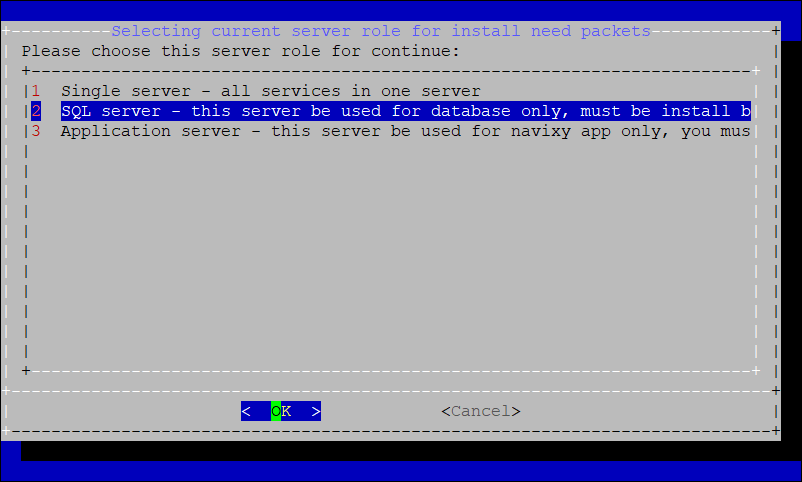

The script will begin with a system and software check. You will see that MySQL is being installed and configured. You will see a request to restart MySQL, confirm this by entering `1`. Next, you will be asked to confirm databases initialization, answer affirmative again by entering `y`.

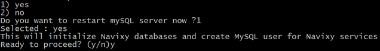

MySQL will ask you to specify the root password. It is not mandatory for the platform so you can leave it blank. If you specify any, be sure to remember it. Next, the script will create databases and the DB user _navixy_ with random password. This will be the main user for the platform services to interact with the database.

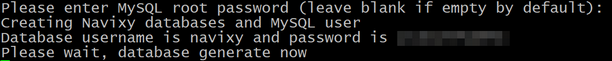

The script will then populate the database with system tables. After the database initialization, you will see the following information regarding the database server:

* Username: _navixy_ - this is the DB user specified in system configs for the database interaction.
* Password: _random_ - the password for _navixy_ user.
* IP address: your DB server actual address.

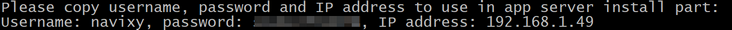

Be sure to save these values, as you will need them during the application server installation.

### Application server

Open `/navixy-package` directory and run the `install.sh` script from it.

```
./install.sh
```

You will be asked to select the server role for further deployment. Select **#3 Application server**.

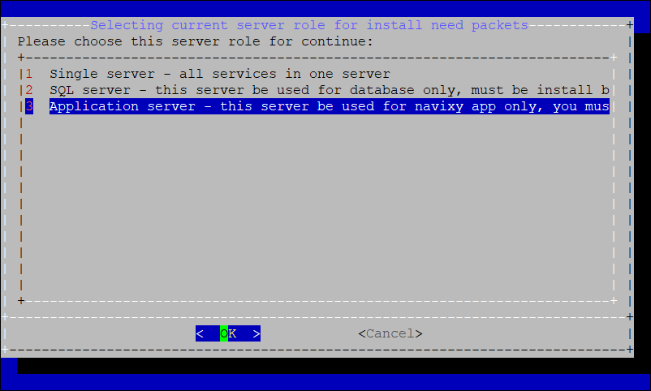

The script will download and install Java, Nginx and other pre-requisites to run the platform. This will be done automatically and does not require your attention. After all the pre-requisites are installed, the script will ask you for SQL server user password. This is _navixy_ user password that you obtained after installing the database at the previous step. Use `Shift+Insert` to paste it from the clipboard.

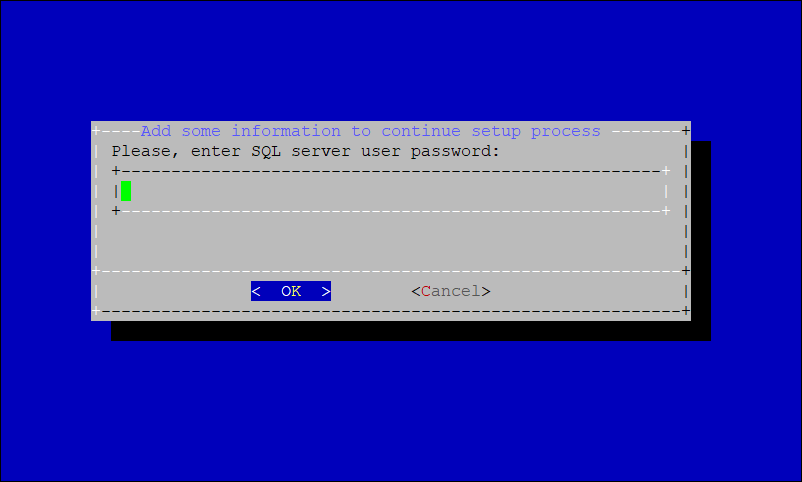

You will then be prompted for the IP address of your database server. Enter it.


The script will make sure that the IP is valid. You will then be asked to confirm the platform installation on your server.

Do this by typing `y` and pressing `Enter`.

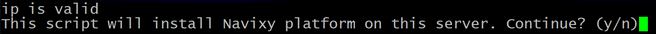

### Domains

The script will ask you to specify a domain name for your service. This is a domain used for:

* All the system services in one-domain installation.
* User interface and devices activation in three-domain installation.


Next, you will be asked for API and Admin panel domains.

* For one-domain installation, leave these values blank and press Enter (OK).
* For three-domain installations, specify API and Panel domains accordingly.


You will see a notification about the domains configuration you have made.

Next, you will be prompted to perform the installation of SSL certificates for your platform. If this is what you want to do, click `Yes` and follow the wizard prompts.

For details on installing the SSL certificate, see the [Configuration wizard](configuration-wizard.md) page.

At this point, the basic platform installation is complete. If you need more customization, use the [**./configure.sh**](configuration-wizard.md) script.
