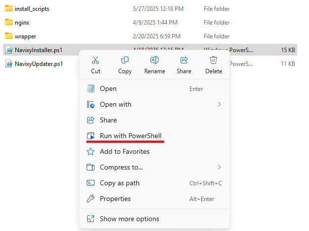
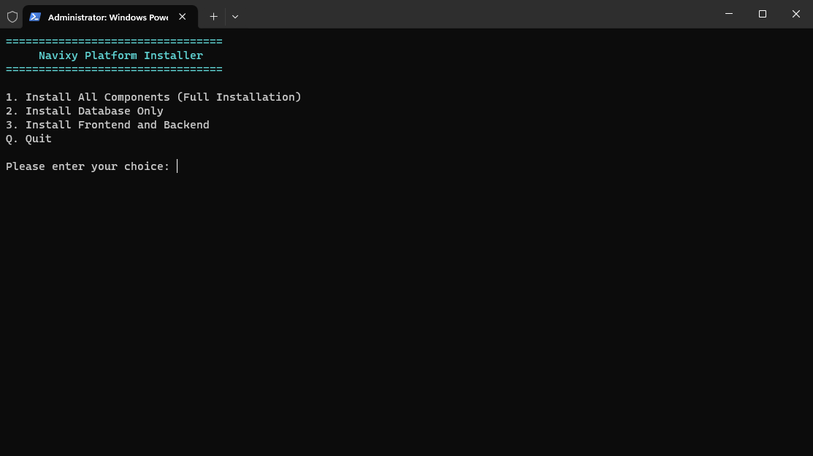
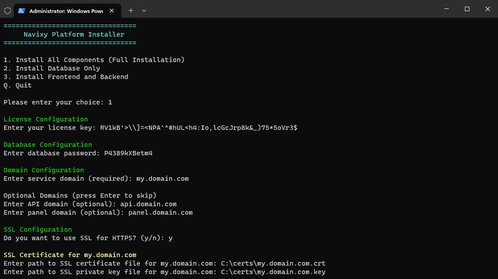
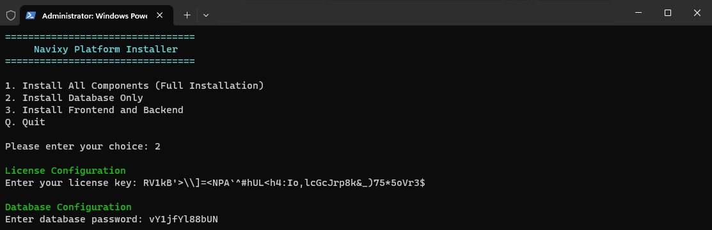
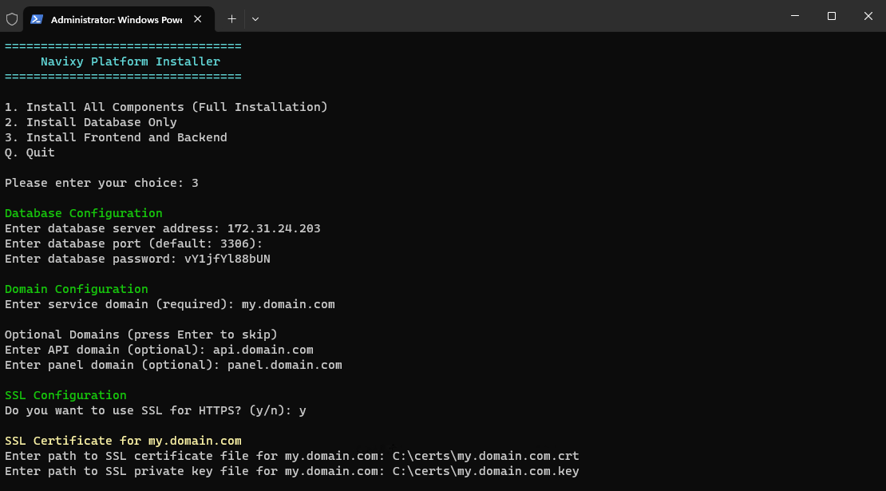
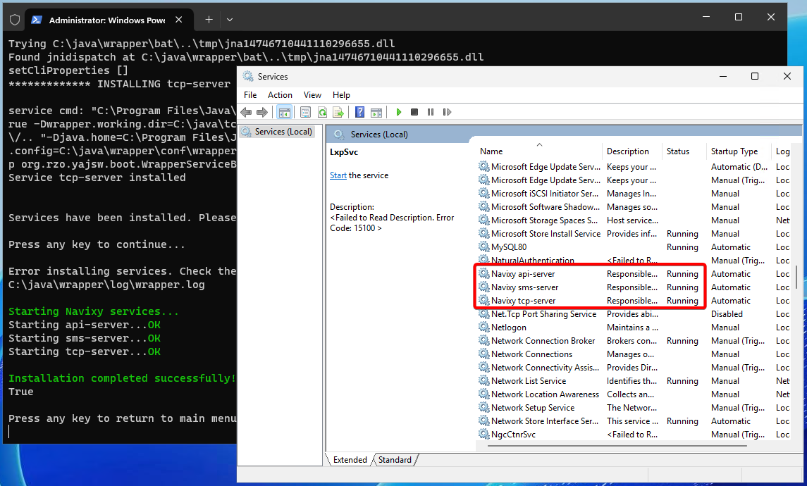

# Automatic installation - Windows

This guide describes Navixy On-Premise platform installation using automated script. This type of installation is designed for Windows servers.

For Linux servers, please use the appropriate instructions.

## Installation prerequisites

First, you need to have the following before you start the installation:

* A server (or servers) meeting all the [Server hardware](../../../requirements/server-hardware.md) requirements. Please note that Windows servers are generally more resource-intensive, so providing extra RAM and CPU resources is always advisable.
* Windows Server of the latest version available to you. The installation script was developed on Windows Server 2025, but uses Powershell, so it is applicable to any up-to-date OS version.
* Navixy software package and License key provided by Navixy team.
* Registered domain name(s) that you will use for your Navixy instance.


If you are not planning to use dedicated domains for API and admin panel, the configurator will configure access to these components as subdirectories of the basic domain.


This automatic process will install all the software prerequisites listed in [Server software](../../../requirements/server-software.md) document meaning that you don't need to install them yourself manually. However, for Windows, it is recommended to utilize third-party software such as:

* Advanced text editor to handle configurations and large log files (such as [Notepad++](https://notepad-plus-plus.org/downloads/)).
* Any archiver capable of working with `tar.gz` archives (such as [7zip](https://www.7-zip.org/download.html)). The latest Windows versions are capable of handling this archive type natively so the third-party archiver may not be needed.

The entire installation process must be performed **as administrator**.

### Network configuration

Depending on the initial settings of your server, it may not have open ports necessary for the normal functioning of the platform. You may need to explicitly open these ports in Windows firewall.

This typically includes ports such as:

* HTTP/HTTPS ports 80 and 443.
* Port 32233 for license verification.
* Any dedicated ports to connect tracking devices.
* Port 3306 for working with the database on a dedicated server.

For more information, check the Network page in our instructions.

## Navixy package

Navixy On-premise distribution package is always available for download at the direct link:

[⬇️ Download Navixy package](https://get.navixy.com/latest)


Your browser may warn you that the download is not secure - this is normal for tar.gz archives. Ignore the warning and download the archive safely.


Unpack the newly downloaded archive and navigate to the folder named `\navixy-package`. This will be the main folder this instruction works with, and any nested paths will refer to it unless explicitly specified.

## Installation script

Proceed to `\navixy-package\windows` folder and run the `NavixyInstaller.ps1` script with Powershell:

This will initiate the installation process, and you will see the installation type selection menu:

You can choose to install all components on a single server or deploy database and application on dedicated servers.

Further steps will depend on the type of installation you choose.

## All components on one server

To deploy the entire platform on a single server, select `Install All Components (Full Installation)` - type the corresponding number `1` and press Enter.


If you are going to deploy the database on a dedicated server separately from the application, skip this section and proceed to **Two servers** section below.


The script will ask for the following values:

* **License key** - enter the combination of characters received from Navixy Technical Support. If you do not have a license key, terminate the installation and contact your Account Manager or Technical Support.
* **Database password** - this password will be assigned to the database user `navixy` and will be used by backend services to access the database.
* **Service domain** - basic domain of your instance. Will be used by your clients to access the tracking service.
* **API domain** (optional) - if specified, will be used to access API. If not needed, press Enter to skip.
* **Panel domain** (optional) - if specified, will be used to access Admin panel. If not needed, press Enter to skip.
* **SSL configuration** - `y` for HTTPS, `n` for HTTP.
* **SSL certificate paths** - full paths to certificates (in `crt` format) and private keys (in `key` format) for each of the specified domains. The certificate and private key files must be located in any folder on the server.

After specifying the required parameters, the script will install the platform and all the necessary software. Here you will need to wait for some time. Here are the automatic actions you will see in the Powershell interface:

1. JDK installation
2. Nginx download
3. MySQL installation
4. MySQL configuration
5. Database structure loading
6. Web site configuration
7. Backend services configuration

No active participation is needed on your part. If the script encounters any errors, it will notify you.

At this point, the installation is finished. Proceed to the Final steps section to check the platform operation.

## Two-server installation

This section describes the installation of the platform split into two servers - a dedicated database server and a dedicated application server. Here you need to unpack `/navixy-package` on both servers and start with deploying the database.

### Database server

Run the `NavixyInstaller.ps1` script with Powershell and select `Install Database Only` - type the corresponding number `2` and press Enter.

The script will ask for the following values:

* **License key** - enter the combination of characters received from Navixy Technical Support. If you do not have a license key, terminate the installation and contact your Account Manager or Technical Support.
* **Database password** - this password will be assigned to the database user `navixy` and will be used by backend services to access the database. **Save this password!**

After specifying the required parameters, the script will install MySQL, import the database structure and populate it with default values. Wait for some time until the script finishes its operation.

Save the following values:

* Server IP address
* Database password

You will need these values at the next stage.

### Application server

Run the `NavixyInstaller.ps1` script with Powershell and select `Install Frontend and Backend` - type the corresponding number `3` and press Enter.

The script will ask for the following values:

* **Database server address** - enter the IP address of your database server. It can be a private or public IP depending on your network and firewall configuration.
* **Database port** - the default port is 3306, so if you did not intentionally change it when installing the database, you can skip this step by pressing Enter.
* **Database password** - this password will be assigned to the database user `navixy` and will be used by backend services to access the database.
* **Service domain** - basic domain of your instance. Will be used by your clients to access the tracking service.
* **API domain** (optional) - if specified, will be used to access API. If not needed, press Enter to skip.
* **Panel domain** (optional) - if specified, will be used to access Admin panel. If not needed, press Enter to skip.
* **SSL configuration** - `y` for HTTPS, `n` for HTTP.
* **SSL certificate paths** - full paths to certificates (in `crt` format) and private keys (in `key` format) for each of the specified domains. The certificate and private key files must be located in any folder on the server.

After the required parameters are specified, the script will install the platform and all the necessary software. Wait for some time until the script installs JDK and Nginx and then configures the application. If the script encounters any errors, it will notify you.

At this point, the installation is finished. Proceed to the Final steps section.

## Final steps

After the script completes the application deployment, the Windows Services window will open. Wait for a couple of minutes, refresh the window and check the statuses of Navixy services:

* Navixy api-server
* Navixy sms-server
* Navixy tcp-server

All three should be active (running), like in the screenshot below:


If `Navixy tcp-server` shuts down, this is most commonly an indication of an incorrect license key. Contact Navixy technical support for further instructions.


### Admin panel access

Once everything is installed and services are functional, you need to check the availability of your Admin panel domain in your browser. When you specify it in the address line, you should be directed to the login page.

The login credentials are default:

* username: _admin_
* password: _admin_

Consider changing your password for the Admin panel right after the login for security reasons.

### Accessing User interface

For the user interface to be available, you need to specify its domain in the Admin panel → Service Preferences first, as described in this document: [Domain name](https://app.gitbook.com/s/KdgeXg71LpaDrwexQYwp/settings/domain-name).

If the above is not done, the user interface will not be able to open.

### Updates

To update Navixy deployed on Windows system to the most current version, please refer to this document: [Update on Windows](../../update/update-windows/)

### Troubleshooting

If you encounter any issues during the installation or configuration process, please refer to the [Troubleshooting](../../../troubleshooting/) pages for possible solutions.
