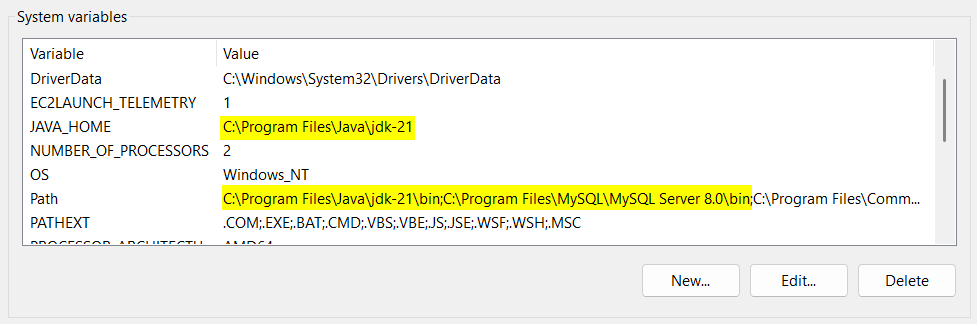
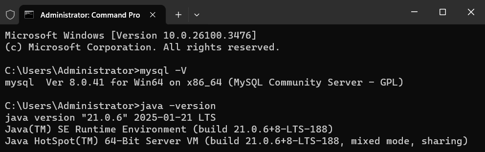
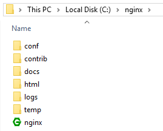
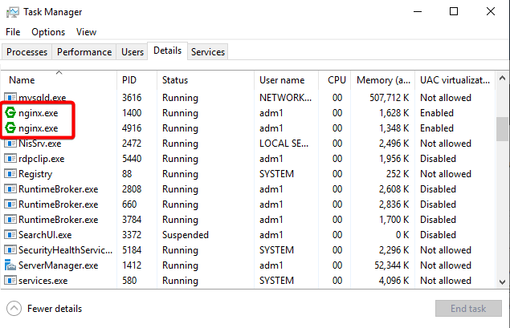
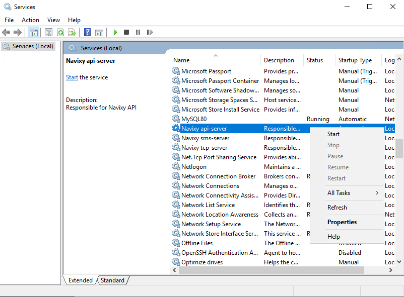

# Manual installation - Windows

This page describes a process of manual installation of the Navixy On-premise solution on Windows. We recommend using **Windows Server 2016 or newer**. If you want to install the platform on any other version of Windows, for example desktop versions, you can still apply this guide, as the basic principles and software are the same. However, only server versions are considered a reliable solution.


The fully manual installation of Navixy-On-premise for Windows is provided for clients who need full control over the installation process or who have custom configuration requirements. In general, it is recommended to perform an automated installation on Linux, as it is much easier and more flexible not only for the initial installation, but also for future administration and maintenance. Windows installation instructions are available for those customers who are focused on using this OS exclusively due to corporate requirements or other internal reasons.


Although the platform uses the same third-party software on both Linux and Windows, the main difference in its operation is how the services work on Windows:

* Java services are converted into Windows services using YAJSW software.
* Nginx is not a service but a regular program running in the background.

To perform the installation, you need a Windows account with **administrator privileges**. It doesn't matter if it's a local or domain account because the platform is not related to the domain infrastructure in any way. You only need sufficient rights to install it.

## Install pre-requisite software

Download and install the pre-requisites described in [Server software](../../../requirements/server-software.md) document. Essentially, you will need these components to get the platform up and running:

* [MySQL 8.0](https://dev.mysql.com/downloads/installer/) - only Server is required, other components are optional;
  * Microsoft Visual C++ may be required for installation. Setup wizard will notify you about it.
* [Java SE Development Kit 21](https://www.oracle.com/java/technologies/downloads/#jdk21-windows);
* [Nginx](https://nginx.org/en/download.html) - any recent version (it does not need installation, just extract it);

In addition to the basic components, it is also recommended to install the following software to make further work easier:

* Any archiver capable of unpacking tar.gz files - for example [7-Zip](https://www.7-zip.org/).
* Advanced text editor to work with configurations and large log files - for example [Notepad++](https://notepad-plus-plus.org/downloads/).


It is strongly recommended to install third-party software only from official resources - preferably from the links above. If software is installed from unreliable resources, operability is not guaranteed.


### MySQL configuration

After installing MySQL Server, you need to apply changes to its configuration for Navixy platform to work correctly with the database. The configuration is specified in **my.ini** file located at the following path:

`C:\ProgramData\MySQL\MySQL Server 8.0\my.ini`

In this file you need to set the parameters below under `[mysqld]` section. If they are already present - change them accordingly.

```
default-time-zone='+00:00'
sql-mode="NO_ENGINE_SUBSTITUTION"
innodb_buffer_pool_size=10G
```

The `innodb_buffer_pool_size` parameter is the amount of RAM allocated for MySQL. It is strongly recommended to set this parameter to **70% of total RAM** on your server (in gigabytes).

After the configuration is changed, save the file and **restart MySQL** from Windows Services snap-in (services.msc) to apply changes.

### Environment variables

Java and MySQL `bin` folders must be specified in Windows `PATH` system environment variable. These folders are (by default) as follows:

* `C:\Program Files\Java\jdk-21\bin`
* `C:\Program Files\MySQL\MySQL Server 8.0\bin`

Java installation folder must also be added to the new `JAVA_HOME` system variable. This is required for the backend services to work properly


Folder names may vary from version to version, so check the actual paths first.


You can update the environment variables with the following commands from command line:

```
setx /m Path "%PATH%;C:\Program Files\Java\jdk-21\bin;C:\Program Files\MySQL\MySQL Server 8.0\bin"
setx /m JAVA_HOME "C:\Program Files\Java\jdk-21"
```

This will create the required values.

You can also update the `Path` and `JAVA_HOME` environment variables manually in system properties.

As a result, you must have the following:



After the variables are saved, open the command line and check the versions of software with the following commands:

```
mysql -V
java -version
```

If the versions are returned, then the variables are configured properly.



If you see the errors like `is not recognised as an internal or external command`, check the paths you specified before.

## Unpack the platform

Navixy distribution package is provided as a .tar.gz archive. The latest version is always available for download at the following link:

[⬇️ Download Navixy On-premise package](https://get.navixy.com/latest)

Place it to any folder on your server and extract it.


The package has a plenty of nested folders, so be careful not to exceed Windows limit of 255 symbols in file path.


Place `navixy-package` folder from the archive to some directory like: `C:\distrib\navixy-package`

Hereinafter this will be the main folder of the distribution. Further in this instruction you can find paths like `...navixy-package/db`, which means that operations must be performed from this folder and its subfolders.

After unpacking the platform and preparing all the pre-requisites, you are ready to start Navixy platform installation.

## Navixy databases

First, you need to perform MySQL database configuration. It is recommended to work with MySQL from the command line. Connect to MySQL as `root` user with the password you set during MySQL installation:

```
mysql -uroot -p
```

Execute the below queries block. Substitute `<PASSWORD>` with a new password for `navixy` user, remember it, you will need it later.


```sql
CREATE USER navixy@'%' IDENTIFIED BY '<PASSWORD>' WITH MAX_QUERIES_PER_HOUR 0 MAX_UPDATES_PER_HOUR 0 MAX_CONNECTIONS_PER_HOUR 0 MAX_USER_CONNECTIONS 0;
CREATE DATABASE google CHARACTER SET utf8 COLLATE utf8_general_ci;
CREATE DATABASE tracking CHARACTER SET utf8 COLLATE utf8_general_ci;
GRANT USAGE ON *.* to navixy@'%';
GRANT ALL PRIVILEGES ON google.* TO navixy@'%';
GRANT ALL PRIVILEGES ON tracking.* TO navixy@'%';
```


This will create empty databases for further use.

Quit MySQL and return to command line.

### Database contents

Change the directory in command line to `...navixy-package\db`.

Execute the following command to import the business data tables structure:

```
mysql -uroot -p google < google.sql
```

After that, delete the `updates.sql` and `google.sql` files with the following commands, as they are not needed in the next step:

```
del updates.sql
del google.sql
```

Now import the remaining files into the database using this command:

```
type *.sql | mysql -uroot -p google
```

### File server

Connect to MySQL again and execute the below SQL query. This will allow to upload files from the mobile app and web interface to your server, which is required when working with field service forms, vehicle maintenance and other features. Change `api.domain.com` to your domain for API, and change `https` to `http` if you do not use SSL.


```sql
INSERT INTO google.file_storages (id, engine, config) values (1, 'local_fs', '{"base_path":"./files/","base_upload_url":"https://api.domain.com/file/upload","base_download_url":"https://api.domain.com/file/dl","secret":"s3cCr3Et","upload_credentials_ttl":"10m","is_dynamic_preview_enabled": true,"dynamic_preview_pattern":"(.+)/file/dl/(.+)","dynamic_preview_replace":"$1/file/preview/$2","security_module":{"type":"hashid","salt":"S4lTh45hV4lu3","ttl":"7d","min_length":8}}');
```


The values of `secret` and `salt` are recommended to be a random hash of letters and numbers.

### License key

Finally, apply the license key (fingerprint), which should be provided by Navixy. It looks like a long string of random symbols.

Insert fingerprint into the database with the below query. Change `<FINGERPRINT>` to the received value):

```sql
UPDATE google.variables SET value='<FINGERPRINT>' WHERE var='fingerprint';
```


Fingerprint is dynamic. It is updated each time your server connects to the [auth.navixy.com](http://auth.navixy.com/) licensing server. This happens every 3 days and at every service startup. So you do not need to store it separately from the platform as it is constantly changing. Also for this reason you cannot use it on multiple instances. The key can only be used for a single Navixy On-premise instance.


## Frontend

The next step is to set up Navixy On-premise platform frontend - configuring Nginx web server and user interface static files.

Create `nginx` folder on disk `C:`.

```
md nginx
```

Copy the unpacked Nginx distribution to `C:\nginx`.



### Static files

Create a folder named `www` in `C:\nginx`. Copy `panel-v2` and `pro-ui` folders from `navixy-package` into it. These are the folders containing Navixy website static files - actually, all its visible contents. Now you need to rename the configuration files:

* Open `\panel-v2` folder and rename the file `PConfig.example.sa.js` to `PConfig.js`.
* Open `\pro-ui` and rename `Config.example.sa.js` to `Config.js`.
* Open `\pro-ui\static` and rename `app_config.example.sa.js` to `app_config.js`.


In all of the above steps, just remove `.example.sa` entry from file names. Be careful not to confuse files with similar names in the folders.


### Nginx

Add the following lines to `http` block of `C:\nginx\conf\nginx.conf` file:

```
include conf.d/*.conf;
server_names_hash_bucket_size 64;
```

Copy a folder named `include` from `...navixy-package\windows\nginx` to `C:\nginx\conf` folder.

Create a folder named `conf.d` in `C:\nginx\conf`. This folder will contain the configuration for platform website.

Copy these files from `...navixy-package\windows\nginx` to the newly created `C:\nginx\conf\conf.d` folder:

* `map.conf`
* `navixy.conf`

If you are going to use SSL protection on your server, so that your website opens via HTTPS, also copy this file:

* `navixy_ssl.conf`

Now, configure `navixy.conf` and `navixy_ssl.conf` according to [**Nginx configurations**](../../../configuration/nginx-web-server.md) page. These are the main configuration files for the web server, so take extra care when editing them.


To configure the platform to work over HTTPS, you will need a valid SSL certificate issued for your domain, along with its private key. In the absence of the certificate and its matching private key, the web server with the “443 ssl” option will fail to run. To learn more about SSL certificates and their operation on the platform, please refer to [SSL certificates installation](../../../configuration/ssl-certificates/ssl-certificates-installation.md) page.


After all of the above is done - **run nginx.exe as administrator**. Make sure it is up and running in Task manager (normally it has two or more processes). If it stops working, check `C:\nginx\logs\error.log` for errors and act accordingly.



## Backend

This part consists of two steps: configuring Java services and converting them to Windows services.

### Java services - pre-configuration

Create `java` folder on disk `C:`.

```
md java
```

Copy the following folders from `...navixy-package` to `C:\java`:

* `api-server`
* `sms-server`
* `tcp-server`

In each of these folders, move the `conf` subfolder from the dist subdirectory to the service folder. Use the following commands in command line to make this easier.

```
move C:\java\api-server\dist\conf C:\java\api-server\
move C:\java\sms-server\dist\conf C:\java\sms-server\
move C:\java\tcp-server\dist\conf C:\java\tcp-server\
```

Open each of three `conf` subfolders one by one and find `db.properties` files inside. These are the files for configuring the platform services to connect to the database. To ensure proper functioning of each service, you need to update the database connection credentials for each of them. Edit the following lines in the configuration files (`<PASSWORD>` refers to the password you previously created for the user "navixy")

```
db.username=navixy
db.password=<PASSWORD>
```

If your database is hosted on a separate server, you also need to change the `db.connectionString` line in the same files. Specify the actual address of your database server instead of `localhost`, but do not change anything else in this string.

### Java services - API-server

Open the file `C:\java\api-server\conf\config.properties`.

Edit the following lines:

* `api.externalBaseUrl=` - URL of your API domain (with `http://` or `https://` in the beginning). **i**
* `feedback.toEmail=test@localhost` - address to receive feedback/help requests from users.
* `feedback.defaultFromEmail=do-not-reply@localhsot` - default sender of help emails.
* `feedback.substituteFromEmail=false` - toggles whether the help messages are sent from default sender (false) or from user's personal email address (true).


If you don't have a dedicated domain for the API, your base domain is specified here with `/api` appended, e.g.: `https://my.domain.com/api`


### Java services - SMS-server

This service does not require configuration and utilizes default settings.

### Java services - TCP-server

Open the file `C:\java\tcp-server\conf\config.properties`.

Edit the following lines:

* `externalIP=127.0.0.1` - specify the IP address of your user interface instead of `127.0.0.1`.
* `externalHostname=myhost.ru` - specify the domain of your user interface insread of `myhost.ru`.

The above settings will be used for devices automatic activation.

### Java services - converting to Windows services


At this stage, third-party software is used - it is called YAJSW (Yet Another Java Service Wrapper). This is a freeware that is used to run Java applications as Windows services. More information can be found [on the project web page](https://yajsw.sourceforge.io/). The software itself is included in Navixy package.


Copy the folder named `wrapper` from `...navixy-package\windows` to `C:\java`.

Run command line as administrator and change directory to the following:

```
cd C:\java\wrapper\bat
```

Run `setenv.bat` from this directory in the command line.

```
setenv.bat
```

Execute the following commands, one by one:

```
wrapper.bat -i ../conf/wrapper.api-server.conf
wrapper.bat -i ../conf/wrapper.sms-server.conf
wrapper.bat -i ../conf/wrapper.tcp-server.conf
```

This will install the platform Java services as regular Windows services.

Open the **"Services"** snap-in. You can search for it in start menu, or just run the following in cmd:

```
services.msc
```

Scroll the services list and find the newly installed Navixy services. Launch them one by one.

* **Navixy api-server**
* **Navixy sms-server**
* **Navixy tcp-server**



Make sure that the services keep working over time - they must have a “Running” status constantly. If any of them crashes, [check their logs](../../../troubleshooting/working-with-logs/) for possible errors.

## Final steps

### Accessing Admin panel

Once everything is installed and launched, you need to check the availability of your Admin panel domain in your browser. When you specify it in the address line, you should be directed to the login page. If the domain is not directing you to the correct page, double check your web server configuration settings to ensure they are correct.

Consider changing your password for the Admin panel as soon as you log into the system, as the credentials are default:

* username: _admin_
* password: _admin_

### Accessing User interface

For the user interface to be available, you need to specify its domain in the Admin panel → Service Preferences first, as described in this document: [Domain name](https://app.gitbook.com/s/KdgeXg71LpaDrwexQYwp/settings/domain-name).

If the above is not done, the user interface will not be able to open.

### Updates

To update Navixy deployed on Windows system to the most current version, please refer to this document: [Update on Windows](../../update/update-windows/)

### Troubleshooting

If you encounter any issues during the installation or configuration process, please refer to the [Troubleshooting](../../../troubleshooting/) pages for possible solutions.
