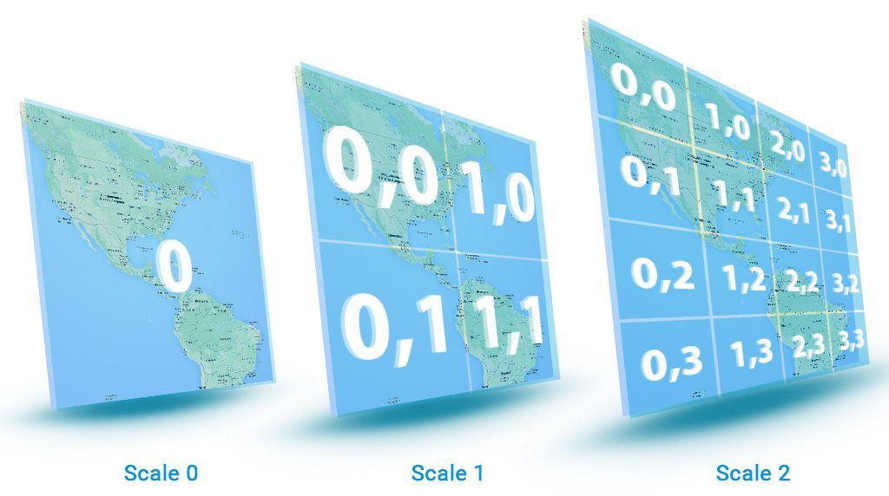

# Map tile servers

A map tile server is a server that provides Navixy applications with map tiles, which are small square images used to display geolocation data. By running your own map tile server, you can offer customized maps for specific areas or additional map layers to your users, such as enterprise assets overlaid on the map.

To add a new map layer to Navixy, you will need to follow three main steps:

1. **Preparing map tiles.** The first step is to convert a cartographic document into uniform pieces of tile graphics with connections to graticule values (coordinates) for each scale level. The most common format for map tiles is MBTiles, but other formats like GeoTIFF can also be used. Regardless of the format, all the tile files must be imported in the Mercator projection to ensure correct layer overlapping on any map used by Navixy. The tile size will also be converted to the most common size of 256 ppi.
2. **Launching a tile server.** Once the tile files are prepared, they need to be deployed on a server with each file having its direct link, such as [http://tileserver.com/{z}/{y}/{x}.](http://tileserver.com/%7Bz%7D/%7By%7D/%7Bx%7D.) You can run your own tile-server or use a cloud-based service provided by companies like Mapbox, CartoDB, Esri, or ArcGIS.
3. **Adding the new map layer to the user interface.** After the tile server is started with all cartographic features uploaded, you can integrate it into the Navixy map panel by adding a new external cartographic plugin and providing it with the tile server URL. The new layer will appear in the list of available layers and can be placed separately or with other layers.

## Preparing map tiles

An available cartographic document needs to be converted to tile graphics – uniform pieces with the connection to graticule values (coordinates) for each scale level. One of the most popular tile format is MBTiles created by [Mapbox](https://www.mapbox.com/), but other formats, for example, GeoTIFF can be also used for Navixy.

Regardless of the format, all the tile files must be imported in the [Mercator projection](https://en.wikipedia.org/wiki/Mercator_projection). It can guarantee correct user’s layer overlapping on any type of map that is used by Navixy, because all the maps are made in the Mercator projection. A tile size may vary, thus, it will be converted to the most common size – 256 ppi.

## Launching a tile server

You need to deploy the prepared tile-files on a server. Every file will have its direct link: `http://tileserver.com/{z}/{y}/{x}`. It allows getting a correct response at the request of: `//tileserver.com/{z}/{x}/{y}.png`. The tile server may be launched locally or in the cloud.

### **Option 1: Your local** **tile server**

Running your own tile server is a common task for a system administrator. The configuration process itself is not particularly challenging, but the server requires high computing resources and specialized equipment.

The tile server performs several crucial tasks, including rendering and preparing tiles to be cached, sharing the load and creating a request queue, converting vector data to raster tiles, uploading incoming data to a database (if necessary), and providing database control through the database management system.

System administrators may opt for a Unix-based operating system as it is often more straightforward and cost-effective. Additionally, there are some pre-packaged solutions available. For instance, one may deploy a tile server from Ubuntu packages using the OpenStreetMap mount.

### Option 2: Tile service from a 3rd party (SaaS)

If you prefer not to run your own tile server, there are many companies that offer ready-made solutions for deploying and supporting tile servers. These providers offer all the necessary components and computing resources, so you don't have to worry about setting up and maintaining a tile server yourself. Some of the most popular providers include Mapbox, CartoDB, Esri, and ArcGIS.

Navixy integrates with the majority of these options. Please contact our customer success team to discuss how your preferred map providers can integrate with the platform.
