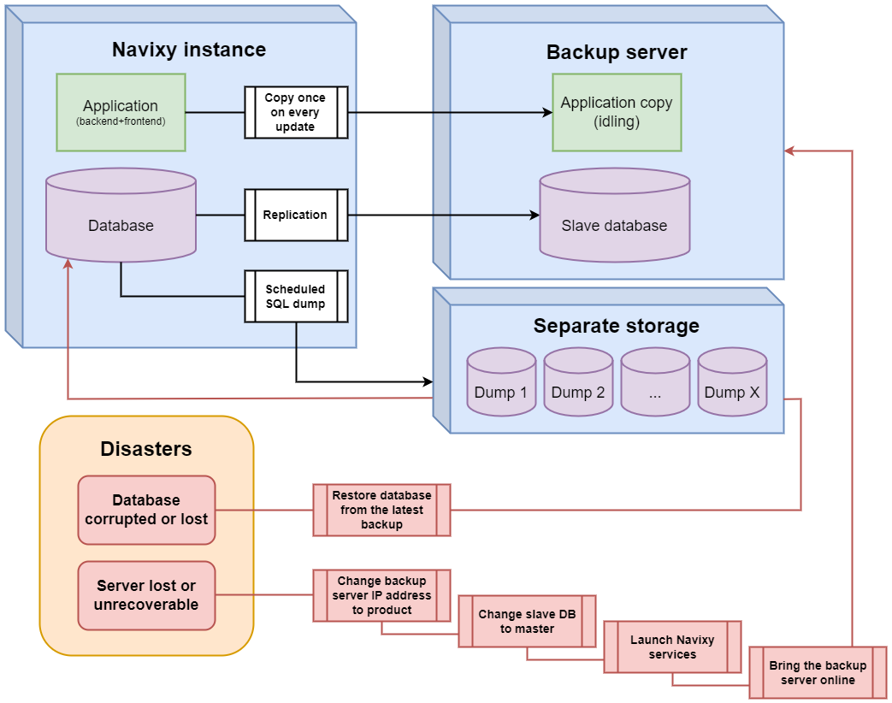

# Advanced backup strategies

Data is one of the most precious things we have. So for any business, data safety is essential. Losing data, even partially, can have serious and long lasting effects on business performance and profitability.

As no one can completely exclude any faults in hardware or software - it's better to be prepared.

In our [Backup strategies](backup-basics.md) document, we explained an example of mysqldump backup process.

[Mysqldump](https://dev.mysql.com/doc/refman/5.7/en/mysqldump.html) is a built-in application that comes with your MySQL server package. It allows you to unload data from the selected databases into SQL, CSV or XML files. This gives you the possibility to edit data before restoring it. However, as it essentially creates a text copy, on high load servers backup creation and restoration from it can take a significant amount of time.

This means your recovery time increases and we want to keep it as low as possible.

There are options that are more suitable for High load servers and will improve your data safety and decrease recovery time.

## Backing up source files

There are several third-party applications on the market that allow you to backup source files of your database instead of unloading all of it into text.

Our preferred method is [xtrabackup](https://www.percona.com/software/mysql-database/percona-xtrabackup) application from Percona.

This neat application allows you to perform a hot backup while the system is running. Process will be seamless for your end users.

Once the backup is done you can choose to make incremental backups (saving only changes made since last full backup) or keep making full backups and storing them somewhere else.

Overall, this works much better and faster than text dumps of database.

Approximate time comparison on full backup of 2TB database - mysqldump 12+ hours, xtrabackup 5.5 hours

## Replication

Backups are a necessity. However, on a high load database, even daily backups do not protect you fully. In this case, your worst-case scenario for data loss is 24 hours. Much better than losing all of it but still a significant amount.

This is where having a replication server comes in handy.

Replication is done in real-time, meaning that at any point you always have an additional copy of your database.

If something happens to your main database server - you can always switch between them, reducing your recovery time to minutes.

## Application backup

All telematics data is recorded in the database and it is constantly updated. Meanwhile, Navixy application files (backend, frontend and their configurations) remain static over time, and all that changes is the logs. So you can simply save the platform files to a separate server and keep a copy of the platform idling there.

That way, if some disaster happens to your primary server, you can switch its IP address to the backup server, launch the platform there and it will continue to work. This simple method will allow you to quickly restore access to the platform with minimal downtime.

After the platform update, you need to re-backup your application files so that the application and database versions match.

## Combined method

Both methods of database backup work great on their own. And using both of them simultaneously can bring you ultimate safety. Below is a simplified backup scheme to achieve acceptable fault tolerance, as well as recovery techniques in case of problems.

Guides on database backup methods are available online. To maximize backup reliability, it is recommended to have a DevOps/DBA specialist on your team.

If you need assistance from our support team - please contact us at [support@navixy.com](mailto:support@navixy.com)
