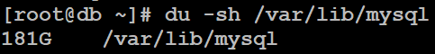
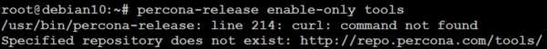

# MySQL backup

This guide will help you make a full backup of your MySQL database without shutting down your system. It was written and tested by Navixy devops team, so you can trust it as a known working solution.


This instruction is valid for MySQL of versions 8.xx (less or equal to 8.0.29) and 5.xx. It is written for, tested and can be applied on the following OS:

* Ubuntu 18.04, 20.04
* Debian 9, 10, 11

For other OS and software versions, it can be applied and adapted on your own risk.


What you need to make a full backup of your MySQL database without shutting down the system:

* Connect an additional volume on a separate disk to which the backup will be performed.
* Install additional software - [https://www.percona.com/software/mysql-database/percona-xtrabackup](https://www.percona.com/software/mysql-database/percona-xtrabackup)
* Get the credentials of an existing MySQL database user or create a user specifically for backup
* All operations should be performed as a user with root rights, or using sudo.

Below we will look in more detail at the steps you need to take.

## Creating a user

As an example we will create the user named `bkpuser` with the minimum rights sufficient to create a full backup and password `s3cret`.

First you need to get into the MySQL console with administrative rights, example:

```
mysql -uroot -p
```

Then, in the MySQL console, enter the commands specific for different versions of MySQL:

**MySQL 5.xx**

```sql
CREATE USER 'bkpuser'@'localhost' IDENTIFIED BY 's3cret';
CREATE USER 'bkpuser'@'%' IDENTIFIED BY 's3cret';
GRANT SELECT, RELOAD, LOCK TABLES, PROCESS, REPLICATION CLIENT ON *.* TO 'bkpuser'@'localhost';
GRANT SELECT, RELOAD, LOCK TABLES, PROCESS, REPLICATION CLIENT ON *.* TO 'bkpuser'@'%';
FLUSH PRIVILEGES;
```

**MySQL 8.xx**

```sql
CREATE USER 'bkpuser'@'localhost' IDENTIFIED BY 's3cret';
CREATE USER 'bkpuser'@'%' IDENTIFIED BY 's3cret';
GRANT BACKUP_ADMIN, PROCESS, RELOAD, LOCK TABLES, REPLICATION CLIENT ON *.* TO 'bkpuser'@'localhost';
GRANT BACKUP_ADMIN, PROCESS, RELOAD, LOCK TABLES, REPLICATION CLIENT ON *.* TO 'bkpuser'@'%';
GRANT SELECT ON performance_schema.log_status TO 'bkpuser'@'localhost';
GRANT SELECT ON performance_schema.log_status TO 'bkpuser'@'%';
GRANT SELECT ON performance_schema.keyring_component_status TO bkpuser@'localhost';
GRANT SELECT ON performance_schema.keyring_component_status TO bkpuser@'%';
FLUSH PRIVILEGES;
```

## Backup volume

Now we need to calculate the size of the additional volume to which the backup will be performed.

In order to determine the size of the volume required for the database backup, you need to find the size of your current database and multiply it by 1.5.

If your database is in a default location that is set when installing MySQL server, you need to run the following command with root rights:

```
du -sh /var/lib/mysql
```

If you have a custom database location, you need to specify the database path as an argument to the location command, i.e:

```
du -sh /your_path_to_database
```

**Example of calculation**



In the screenshot we can see that the current size of the MySQL database is 181 GB Therefore, the volume size for backing up this database must be at least 181 \* 1.5 = 271.5 GB, rounded up to 272 GB

The calculation applies to a single copy of the database. If you plan to keep more than one backup copy of the database, remember to multiply result by the number of stored backups.

## Backup software

After connecting the new volume and creating a file system on it, you need to install the software required for the database backup. This software is called [https://www.percona.com/doc/percona-xtrabackup/LATEST/index.html](https://www.percona.com/doc/percona-xtrabackup/LATEST/index.html). Consider installing it using ready-made installation packages available from the Percona XtraBackup repositories.

The installation is done via the package containing the `percona-release` configuration utility.

First of all, download this package from the Percona XtraBackup repositories with the following command:

```
wget https://repo.percona.com/apt/percona-release_latest.$(lsb_release -sc)_all.deb
```

The next step is to run the installation of the downloaded package using the dpkg utility. You must be _root_ or use _sudo_ to run this command:

```
sudo dpkg -i percona-release_latest.$(lsb_release -sc)_all.deb
```

Now set the repositories necessary for the purpose:

```
percona-release enable-only tools
apt-get update
```

***

### Exception for Debian 10

On Debian 10 the above step returns an error:



To fix this error, you need to edit the file _/etc/apt/sources.list_

Open this file in any text editor, i.e.:

```
root@debian10:~# nano /etc/apt/sources.list
```

Add the following line to the list at the top:

```
deb http://ftp.de.debian.org/debian buster-backports main
```

The contents of the file will look something like this:

```bash
#
# deb cdrom:[Debian GNU/Linux 10.4.0 _Buster_ - Official amd64 NETINST 20200509-10:25]/ buster main

# deb cdrom:[Debian GNU/Linux 10.4.0 _Buster_ - Official amd64 NETINST 20200509-10:25]/ buster main
deb http://ftp.de.debian.org/debian buster-backports main

deb http://mirror.corbina.net/debian/ buster main
deb-src http://mirror.corbina.net/debian/ buster main

deb http://security.debian.org/debian-security buster/updates main
deb-src http://security.debian.org/debian-security buster/updates main

# buster-updates, previously known as 'volatile'
deb http://mirror.corbina.net/debian/ buster-updates main
deb-src http://mirror.corbina.net/debian/ buster-updates main

# This system was installed using small removable media
# (e.g. netinst, live or single CD). The matching "deb cdrom"
# entries were disabled at the end of the installation process.
# For information about how to configure apt package sources,
# see the sources.list(5) manual.
```

Save the changes to the file and then run the following commands:

```bash
apt update
apt install curl/buster-backports
apt --fix-broken install
percona-release enable-only tools
apt-get update
```

***

Now you are ready to install the backup utility. To do this, use the following command as root or sudo:

**for MySQL version 5.xx:**

```
sudo apt install percona-xtrabackup-24
```

**for mySQL 8.xx versions less than or equal to 8.0.29:**

```
sudo apt install percona-xtrabackup-80
```

This completes the installation procedure for the Percona XtraBackup utility.

## Backup creation

Now you will create a full database backup using Percona XtraBackup.

* the backup command is executed on the same server where the copied database is stored
* in the example below the additional backup volume mounted in `/mnt/backups` folder
* a pre-created user `bkpuser` with a password `s3cret` is used to connect to the database

```
xtrabackup --user=bkpuser --password=s3cret --backup --target-dir=/mnt/backups/
```

After completing the backup, you need to prepare the copied database for work. Without this operation, the database will be inoperable.

```
xtrabackup --prepare --target-dir=/mnt/backups/
```

You now have a copy of the database that is up-to-date at the time of its creation, created without stopping the server and without removing the workload from it.

This backup copy can be used to restore your database in case of emergency.
