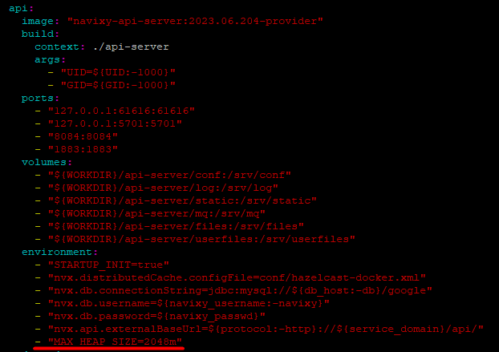

# Memory allocation for services

As your business expands and the number of connected devices inevitably grows, so does the demand for resources to ensure the proper functioning of the Navixy platform. While CPU power and disk space are allocated as needed without any limitations, the maximum amount of RAM that can be utilized is strictly regulated by system configurations. Hence, there might come a time when you realize that the allocated memory is insufficient, necessitating its expansion. In this section, we will provide guidance on locating the required configuration files and making the necessary adjustments to optimize the platform's performance.


When it comes to modifying the configurations that govern the launch of services, utmost caution is required. Exercise great care and attentiveness while editing them to ensure smooth operations.

**Remember!** Careless configuration changes can lead to complete inoperability of the service.\
Prior to making any changes to the config, it is advisable to create a backup copy. Since the config is simply a text file, you can safely store it in a separate directory or save its contents elsewhere, ensuring its integrity and preventing any potential loss.


## Java services

The Navixy platform backend consists of three Java services. The default configurations allocate the following amounts of RAM for them:

* API-server - 1024 Mb
* SMS-server - 512 Mb
* TCP-server - 1024 Mb

This amount of memory is sufficient for stable operation of the platform with up to several thousand devices registered. However, if you are experiencing platform instability, such as slow API queries, long report generation or problems with tracker data processing, increasing the amount of allocated memory may be a solution. Below we will look at where to find the configs that specify this value, depending on how the platform is deployed.

It is recommended to specify the amount of allocated memory as a **multiple of 1024**. The value is specified for each service separately.


When making edits to configs, it is crucial to consider the total available memory. This ensures that you do not specify an amount that exceeds the physical limitations. By doing so, you can effectively optimize the performance and avoid any potential issues.Besides, if Java services and database are located on the same server, do not forget to leave enough space for database operation - by default it is 70% of all memory.


#### Linux - systemd services

For current versions of the platform (both recently installed and those that have received latest updates), **systemd** is used as the service startup manager. The startup configurations are located in the service directories at the following paths:

* `/home/java/api-server/api-server.service.env`
* `/home/java/sms-server/sms-server.service.env`
* `/home/java/tcp-server/tcp-server.service.env`

Inside of each file there is a line like `MAX_HEAP_SIZE="1024m"`. Specify the amount of memory that you want to allocate for the service in megabytes. Do not forget to preserve the letter `m` which stands for megabytes.

[Restart the platform or the specific service](restarting-instance.md) to apply changes.

#### Linux - runit services

If you choose not to switch to systemd when updating your platform to the latest version (this option is offered during automatic updates), or in cases if you are using an old version of Navixy On-premise platform, Java services use **runit** service supervisor. It also has its own configuration files, and they are located at the following paths:

* `/etc/sv/api-server/run`
* `/etc/sv/sms-server/run`
* `/etc/sv/tcp-server/run`

Among the parameters inside each file you will find an `Xmx` value - this is the maximum amount of memory that can be allocated for the corresponding Java service. The whole parameter looks like this: `-Xmx1024m` - this means that 1024 Mb of RAM is allocated for the service. Edit this value and specify what is needed, then save the file.

Restart the platform with `restart-navixy` command to apply changes.

#### Linux - dockered instance

In the dockered version of the platform, memory allocation is set when containers are deployed - when the `docker compose up -d` command is executed. This is a mandatory step when installing and updating an instance, but can be done independently of these processes.

Although the basic instance settings are specified in the `.env` file, a file called `compose.yaml` is used to configure the operation of the containers - it is located in the same instance working folder as the other system files.

Inside this file, you can see the various sections that set the startup options for all containers. To change the amount of allocated memory for _api_, _sms_ and _tcp_ containers you need to find the corresponding sections and add the option `"MAX_HEAP_SIZE="` to the `environment` subsection, for example:

```
- "MAX_HEAP_SIZE=2048m"
```

Below is an example of how this is done for _api-server_ on an existing instance:



Save the file.

After the changes are applied, execute the following command while in the work directory:

```
docker compose up -d
```

This will recreate the containers considering the new settings.


The `compose.yaml` file is replaced when the Navixy dockered instance is updated, and in this case the above settings must be done again. You can do this before you initially run the newly updated instance so that you can run it right away with the necessary settings.


#### Windows - wrapper services

Java services are not designed to exist on Windows by default, so third-party software is used to enable them. It is called **YAJSW (Yet Another Java Service Wrapper)** and is designed to convert regular jar executable files into Windows services. This software is included in Navixy platform distribution package, and is configured during initial installation.

Wrapper does not have a standard installation directory and can be located anywhere, but typically it is placed in the `C:\java\wrapper` folder. Inside you will find the `\conf` folder, which contains configuration files for the three services:

* `wrapper.api-server.conf`
* `wrapper.sms-server.conf`
* `wrapper.tcp-server.conf`

At the bottom of each of the configs are the service startup settings, and they include a line like:

```
wrapper.java.additional.3 = -Xmx1024m
```

The parameter value of `-Xmx1024m` means that 1024 Mb of RAM is allocated for the service. Edit this value and specify the required RAM amount, preserving the `m` letter, then save the file.

[Restart the service(s)](restarting-instance.md) to apply changes.

## MySQL

The database is the most resource-intensive service within the platform. When a large number of devices exert pressure on limited memory, the database may struggle to handle all incoming requests. Consequently, this can result in the Navixy platform operating slowly and with instability. We highly recommend monitoring the database's performance and, if necessary, increasing the server's RAM capacity.

The amount of RAM allocated to the database is a static value that is specified in MySQL configuration. It is generally recommended to keep this value at 70% of the total amount of RAM on the server. Therefore, if you increase the total amount of RAM for better database performance, you need to change the value in the configuration after this.

MySQL configuration file is located at the following path:

* Linux: `/etc/mysql/mysql.conf.d/mysqld.cnf`
* Windows: `C:\ProgramData\MySQL\MySQL Server 8\my.ini`

Under the `[mysqld]` section of this configuration, you will find the parameter `innodb_buffer_pool_size` - it sets the amount of allocated memory for the database. If the current size is insufficient, change the parameter accordingly (be sure to save the measurement unit - `G` for gigabytes). Save the file and restart MySQL.
