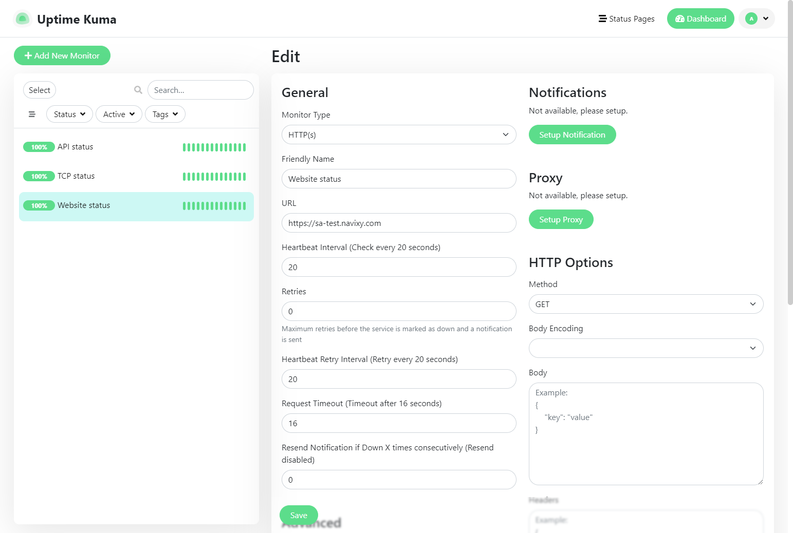
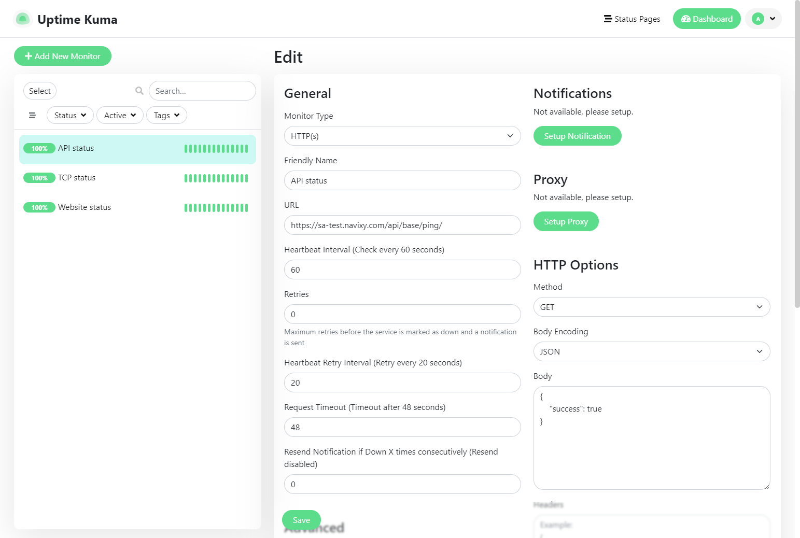
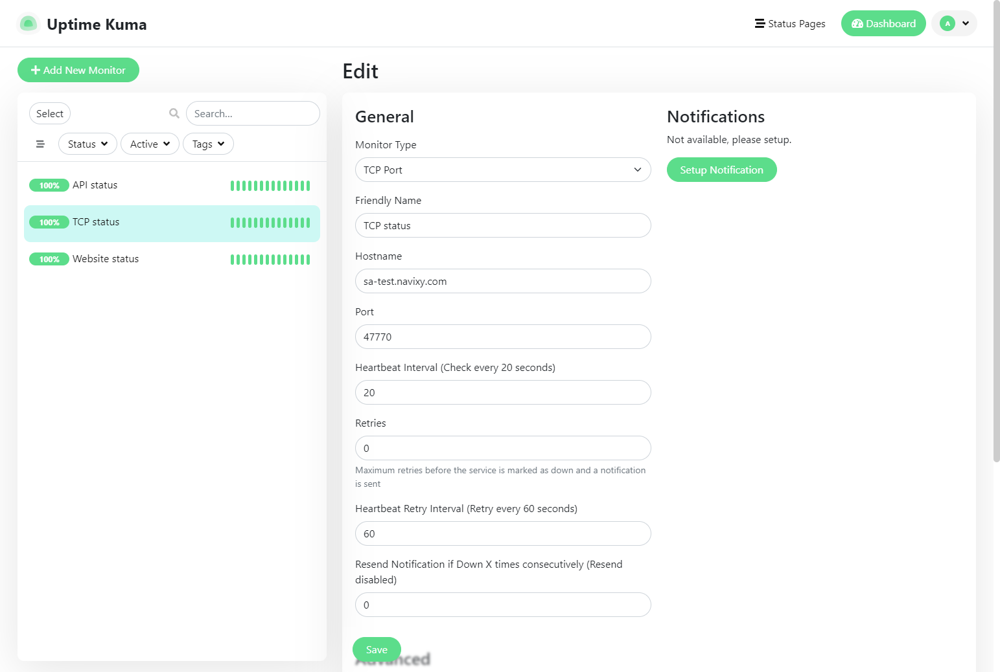
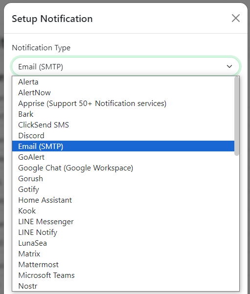

# Uptime Kuma

While there is an abundance of existing service availability monitoring solutions, it can be difficult to find one that meets your basic needs while simply working without complex customizations. Using different approaches to continuous availability, we recommend a simple solution that is suitable for all owners of On-premise instances, whether deployed locally within organizations or in cloud services.

The neat solution we recommend fulfills the following needs:

* Deployed locally on the server (therefore suitable for classified infrastructures)
* Easy to install
* Has a user-friendly interface and is not overloaded with options
* Capable of monitoring a variety of metrics (not just ping an address)
* Supports a variety of notification options (email, sms, messengers and more)

The solution is called Uptime Kuma and is available on the author's GitHub:

[https://github.com/louislam/uptime-kuma](https://github.com/louislam/uptime-kuma)


This solution is designed for external monitoring of service availability, which is usually sufficient. It is not suitable for monitoring any internal metrics, such as status of system services, CPU load, memory consumption, etc.


## Installation

The installation is described in detail on the product page on GitHub, so we won't focus on its details. It is worth noting that the easiest is deploying the docker container, which is done literally in one command.

<details>

<summary>How to install Docker?</summary>

There are many instructions on how to install Docker on different platforms. It is most simple way is to use the up-to-date Linux and perform the installation using these commands:

```sh
curl -fsSL https://get.docker.com -o install-docker.sh
sh ./install-docker.sh
```

If you are using a different platform (Mac, Windows) or wish to install Docker Desktop, please refer to the appropriate section in the Docker documentation:

[https://docs.docker.com/manuals/](https://docs.docker.com/manuals/)

</details>

There is also an alternative method of installation without using Docker, which is also relatively easy and available for Linux and Windows. The choice of installation method is up to you.

It is important to make sure that you have a dedicated port available on your server for Uptime Kuma - the default is 3001.

After performing the installation, Uptime Kuma web interface will be accessible by server address (domain or IP address) and port and immediately ready to use. You will need to set the administrator credentials and proceed to the metrics configuration.

## Metrics

The most important metrics from a business perspective is website availability, customer access to data and recording new data from tracking devices. This is what we will be monitoring.

For each metric, you can specify a heartbeat interval to adjust how often the checks will run (default is 60 seconds), adjust the number of retries (before considering the server down), and set other parameters.

#### Website availability

To get started, create the first monitor that will track domain availability based on HTTPS requests. Select monitor type `HTTP(s)`, give it a name and specify your website URL. This will check the website availability based on HTTP response status codes. The codes are 200-299, so if any other odes will be received (e.g. `404 Not found` or `504 Gateway timeout`) it will be considered a failure and the monitor will report that the service is down.




The “Advanced” section offers extended monitoring configuration options, and in particular certificate expiry notification. Mark this option to be notified when your website certificate expires so you can reissue it promptly.


Save the monitor settings, and it will automatically start tracking the website availability.

#### API availability

API is a core service required for a website to interact with the platform backend, in addition, many clients use it to retrieve data directly from the platform. Therefore, stable operation of API is also of primary importance. And monitoring the operation of this service can be done with one simple API request.

The request looks like this:

```
https://my.domain.com/api/base/ping/
```

And the response of a normally functioning service would be the following JSON:

```
{"success": true}
```

You can configure the monitor to work with this response. To do this, create another monitor with type HTTP(s), specify the API request in URL, and then customize the HTTP options:

* Method: `GET`
* Body encoding: `JSON`
* Body: `{"success": true}`



Save the monitor settings, and it will automatically start checking the API availability by sending the specified request and parsing the responses.

#### TCP availability

Receiving data from devices is critical for the tracking platform. Therefore, it is important to maintain device access and monitor TCP server activity. Since the monitoring service is external to the platform, you can simply monitor the external availability of any of the ports on which the tracking devices connect. For example, it can be port `47770` for X-GPS tracker mobile app, `47776` for Teltonika or any other port for the devices you have in use.

Configure the monitor: select the “TCP Port” monitor type, specify your basic domain and the port of your choice.



Save the monitor settings, and it will start checking the port availability.

## Notifications

For each metric, you have the option to set up notifications so that Uptime Kuma alerts you when unavailability events occur. This way you can have not only graphs of service availability, but also receive urgent notifications if one of the services goes down.



You can set up various types of notifications, but it is important to note that Uptime Kuma is not itself a notification gateway. To set up any type of notification, you need an appropriate external gateway credentials (e.g. SMTP, Twilio, Discord, etc.).

After you specify the notification gateway settings, you will be notified of service problems through the channel of your choice.
