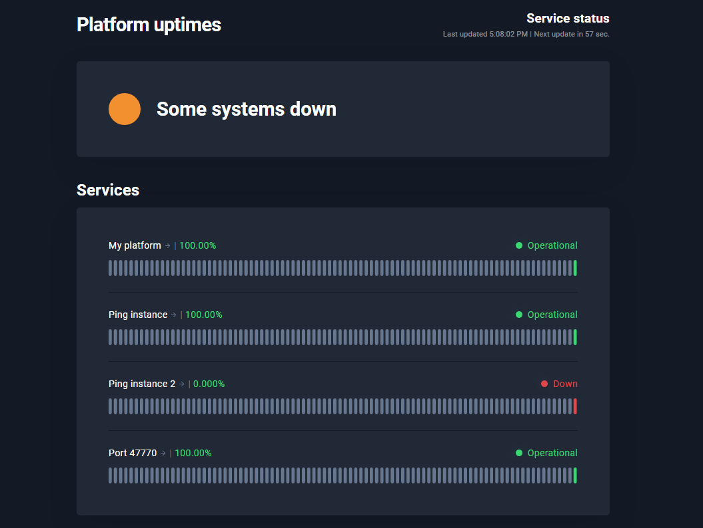
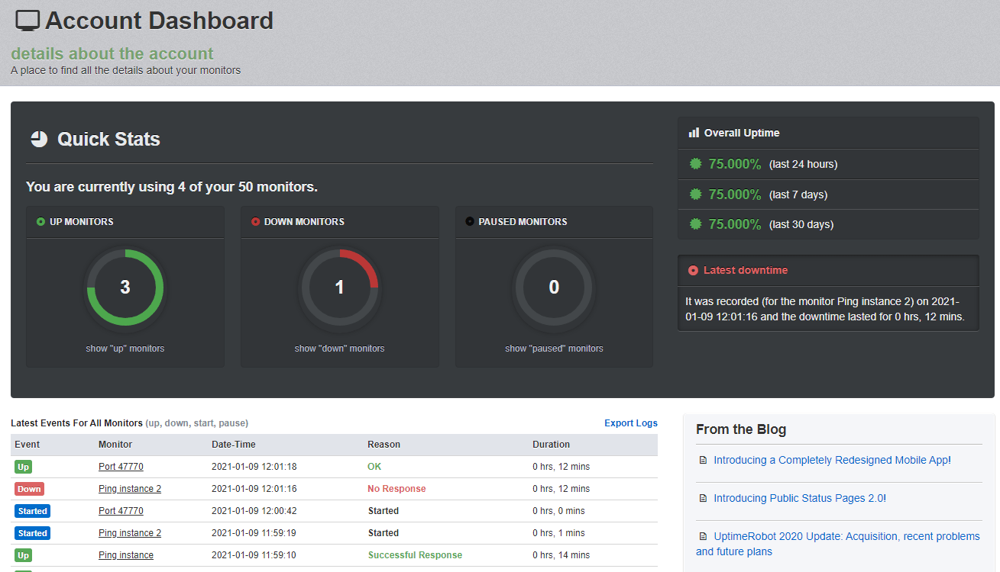

# UptimeRobot

Uptimerobot is a free and user-friendly tool for monitoring web services. The free version is more than enough for basic needs, allowing you to monitor and receive alerts on several crucial metrics such as:

* web page accessibility
* ping test results
* accessibility of a certain port (useful for monitoring device ports or services like SMTP, DNS, POP)
* presence of a specific keyword on a web-page

Like any other service, UptimeRobot has its pros and cons that will let you choose it or move on to other solutions.

The main benefit of UptimeRobot is its simplicity, as anyone can operate the service regardless of their IT skills. Additionally, you do not need your SMTP server to receive alerts. Another notable feature is the ability to create a publicly available dashboard that can be hosted on your domain. You can then link it to your site or share it with customers to keep them informed of the current status at any time.

The paid version of the service offers some interesting features, such as SSL certificate checks and certificate expiration notifications, as well as SMS notifications.

The main disadvantage of UptimeRobot is that it has no hosted solution that can be deployed on your own server. Thus it becomes barely applicable for secure and classified infrastructures as well as most of local data centers. Also, the free version is severely limited in functionality, which may make it of little benefit to your business.

If you are interested in free and locally hosted solutions, proceed to [Uptime Kuma](uptime-kuma.md) or [Zabbix](zabbix.md).
