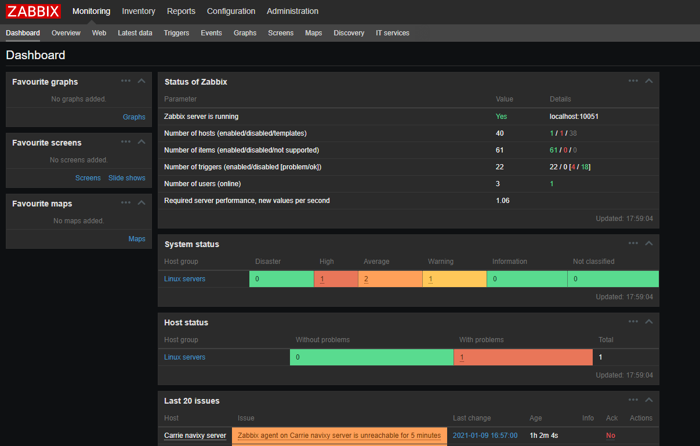
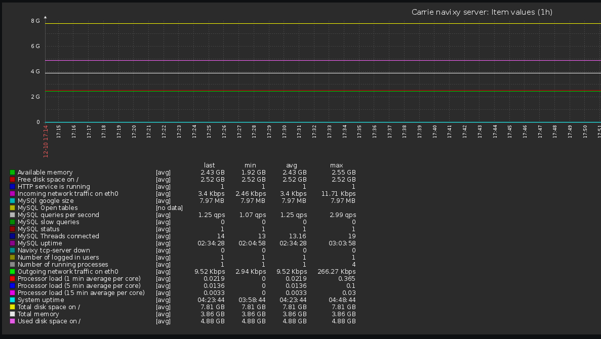

# Zabbix

Zabbix is a powerful, free tool that can monitor various server resources and web-page accessibility. However, unlike other services mentioned, Zabbix needs to be installed on a separate server, making the setup process more advanced. However, this deployment method makes Zabbix ideal for monitoring servers with restricted or no access to the internet.

The configuration process for Zabbix involves two steps: first, installing and configuring the Zabbix server instance, and second, installing and configuring Zabbix monitor services on the servers you want to track. Once these steps are completed, you can monitor everything from basic statistics such as RAM usage, CPU loads, and disk space to more specific options like MySQL status, variable values, and performance.

