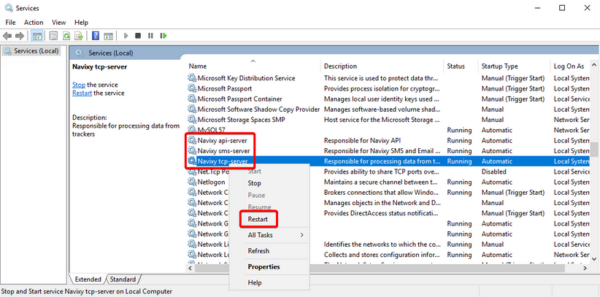

# Restarting instance

Restarting the Navixy platform may be necessary in certain situations such as troubleshooting, configuration changes, or to verify the license, especially after access has been previously suspended due to non-payment.

If you need to perform any of the tasks mentioned above, restarting the Navixy platform backend is usually sufficient. This backend consists of three Java services, namely the "api-server", "sms-server", and "tcp-server".

After restarting the services, it may take 60-90 seconds for them to start and stabilize. Therefore, it is recommended to wait for this period before checking the platform's operation.

## Restarting on Linux

To restart the Navixy instance on on Linux, just run the following command:

```
restart-navixy
```

This command will execute a script that restarts the backend services. The process is fully automated, so all you need to do is wait for it to complete.

You can also restart any of the three backend servers separately. To do this, use the following commands:

```
systemctl restart api-server
systemctl restart sms-server
systemctl restart tcp-server
```

## Restarting on Windows

If Navixy instance is installed on Windows, the platform backend services will work as regular Windows NT services. To access the services, open the **services.msc** snap-in, and you will find three Navixy services in the list:

* Navixy api-server
* Navixy sms-server
* Navixy tcp-server

To restart any required service or all of them, simply right-click on the corresponding service(s) and select "Restart".


