# SSH keys

Remote connection to the server always requires client authentication so that unauthorized parties cannot gain access. The basic method of authentication is the use of a password. But passwords have one disadvantage - they can be cracked, especially if the server owner did not take care of password complexity.

For SSH connections to Linux servers, an alternative method is recommended - SSH keys authentication. These keys are a pair - a private key and a public key. The private key must be stored, respectively, in the client's private environment, and the public key is sent to the server and placed in the `authorized_keys` file.


This method of authentication is not applicable to Windows servers, as RDP connection lacks such functionality.


The use of SSH keys is not a system requirement of Navixy platform, but is strongly recommended for server owners for security reasons.


Do not share private keys with anyone you do not trust. If you need to give access to your server to a third party, it is not necessary to share your own key. Instead, you can request their public key and add it to your server temporarily, then remove it once the work is done.


## Creating SSH keys in Linux

If your workstation is using a Linux-based OS, then you need to use **openssh** package. It may be pre-installed or may require additional installation. On Ubuntu and Debian it is installed with this command:

```
apt -y install openssh-server
```

For other distros, the command may be different.

To start generating keys, run this command:

```
ssh-keygen
```

You will be prompted to enter the path of the file where the keys will be placed. You can leave the default location (in brackets) by pressing Enter, or specify a custom file location and name.

Next, you will be prompted to enter a passprase. It is an extra security measure to protect your key from usage by third parties in case it is compromised. This step is optional.

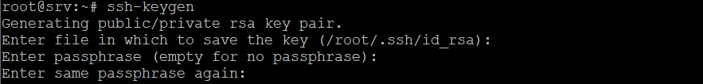

Once you have successfully generated a key pair, you will see a notification:

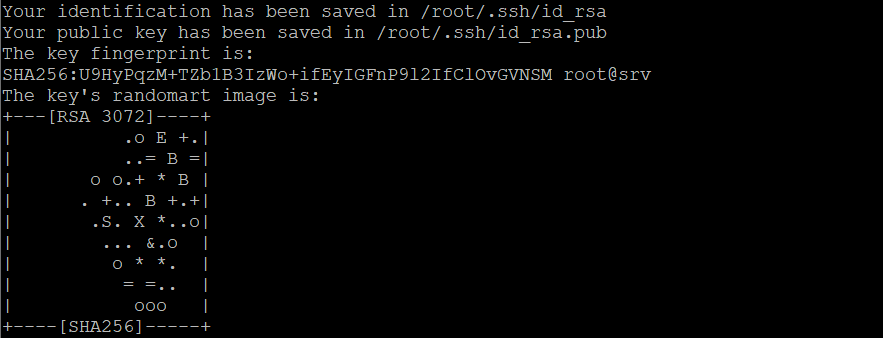

With the default location, the public key is stored in `/root/.ssh/id_rsa.pub`, and the private key is stored in `/root/.ssh/id_rsa`.

Now you need to copy the public key to your server, in the directory of the user on whose behalf the remote connection will be made. Let's assume that the username is `navixy`. Connect to your server and edit the file with any text editor, for example:

```
vi /home/navixy/.ssh/authorized_keys
```

Specify your public key contents after `ssh-rsa`. You can specify a short comment after the key to explain its purpose.

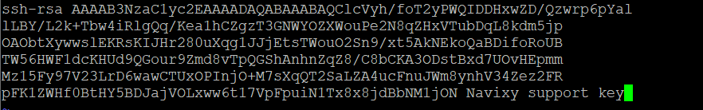

Save the file.

You can now connect to the server using the newly created SSH key.

```
ssh -i id_rsa navixy@myserver.domain.com
```

After this, you can disable password authentication on your server.

## Creating SSH keys in Windows

If you are using Windows, the most common client for connecting to a server via SSH is **PuTTY**. There are also many alternative clients, but they all basically serve the same purpose, so the choice is yours.

In Windows, SSH key generation is performed using **PuTTYgen** utility that comes with PuTTY installation package.

Launch PuTTYgen from the start menu.

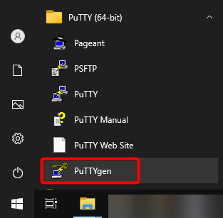

Make sure the `RSA` key type is selected and click **Generate**.

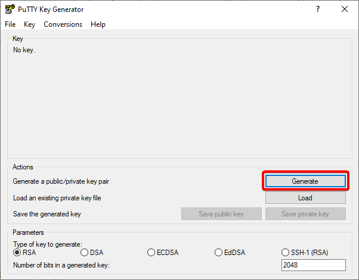

During the key generation process, swipe the mouse several times over an application window to create random values.

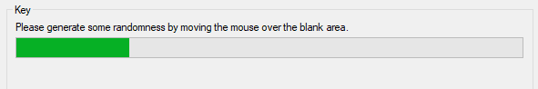

After key creation is complete, the public key will be displayed in PuTTYgen, and the private key will be stored in the application memory. To save these keys, click **Save public key** and **Save private key**. Specify the directory on your PC to store the key files.

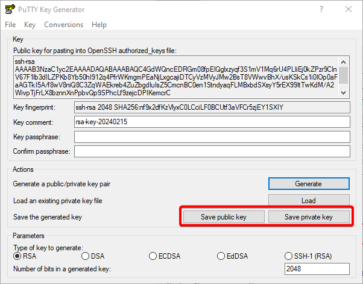

When saving private key, if `Key passphrase` field is not filled in, you will be prompted "Are you sure you want to save this keywithout a passphrase to protect it?". Click `Yes` or return to the previous window to specify the passphrase.

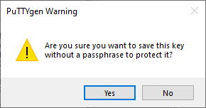

Now the public key must be copied to your server into the `authorized_keys` file. It is located in the directory of the user on whose behalf the remote connection will be made. Let's assume that the username is `navixy`, and in this case the file location will be `/home/navixy/.ssh/authorized_keys`.

Use any file transfer client to work with files on a remote Linux server. Here we will explain the process using **WinSCP** as the most popular client.

Open the `authorized_keys` file via WinSCP for editing.

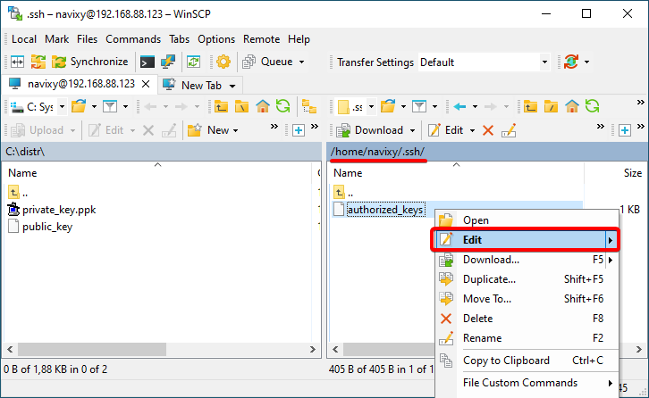

Copy the public key value from the PuTTYgen window or from the previously saved file. The key must stert with `ssh-rsa`. If some key is already saved in the `authorized_keys` file, append the new key after it, starting from a new line.

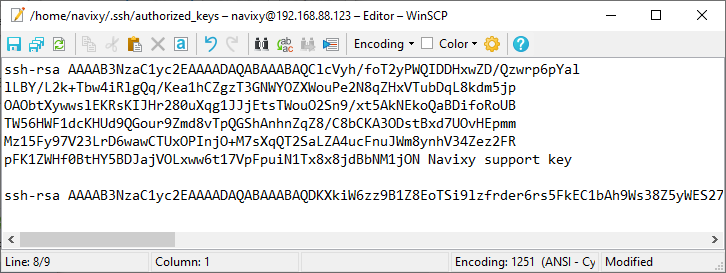

Save the file.

Now you can connect to your server via PuTTY using the private key file. You need to specify the path to it on your PC. To do this, select the required path in _Connection - SSH - Auth - Credentials_ section (new version PuTTY) or _Connection - SSH - Auth_ (old version), in _Private key for authentication_ field.

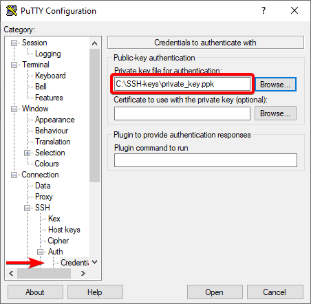

Specify username and server address (e.g. `navixy@myserver.domain.com`) in the _Session_ tab and connect to your server. If everything is done correctly, the connection will be established without the need to enter a password.

## SSH keys in cloud solutions

When you deploy a virtual machine to cloud services such as AWS, MS Azure and similar, you can issue an SSH key at the time you create the machine, or add an existing key if was already created before. When you do this, the cloud service will automatically insert the public key to the `authorzed_keys` of the server user. All you need to do after the server has been deployed is to make an SSH connection using the private key.


Although cloud platforms allow you to create SSH keys, they do not store the private part on their side. Once downloaded private key should be kept safe, because in case of loss access to the server will be impossible.


## Disabling password authentication

Once you have successfully configured key authentication, you do not need to retain password authentication. For security reasons, you can disable it.

Connect to the server via SSH and open the `sshd_config` file for editing, e.g. with Vi editor:

```
vi /etc/ssh/sshd_config
```

Find the parameter `PasswordAuthentication` in the file and set it to `no`:

```
PasswordAuthentication no
```

Save the file. Restart sshd service:

```
systemctl restart sshd
```

Now you can establish the remote connection to your server via SSH only using the previously added SSH key. Password authentication is disabled.
