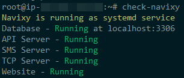
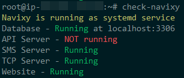
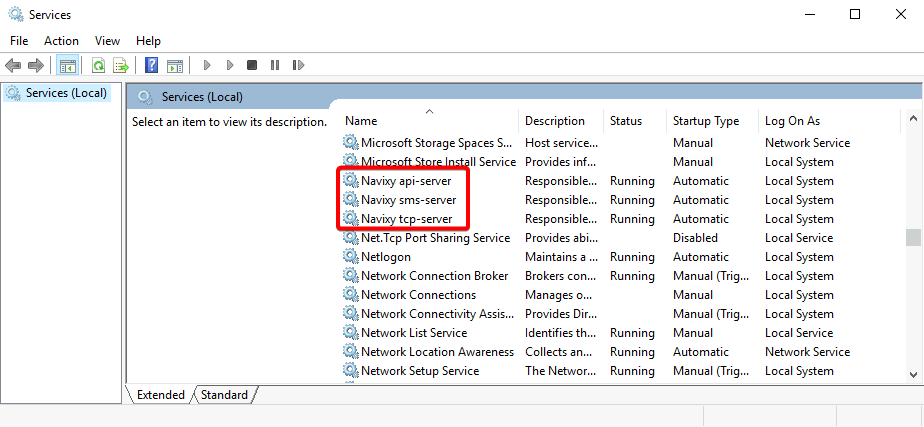
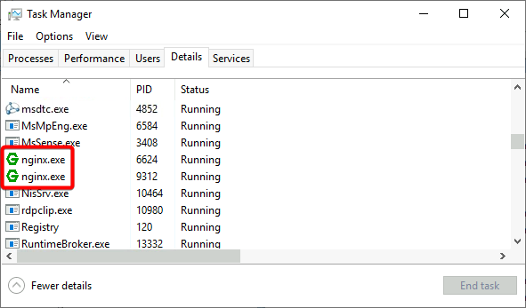

# Checking service statuses

This section will describe general procedure to follow and things to check when troubleshooting Navixy platform issues. It covers basic troubleshooting of Java services, Web server and Database server. Knowing how to check and restart the services will help you understand the cause of the problem and help you solve the problem more precisely.

It is recommended that you first review the information on [System components](system-components.md) page to be aware of configuration and service log file locations.

## General health check

On up-to-date Navixy On-premise instances running on Linux, a script is implemented that does a quick status check of all main components of the platform: database, website and backend services. To use it, login as root and type the following command in the CLI of your server:

```
check-navixy
```

The output will display the type of installation (systemd-based or running in Docker) and the status of each of the services. The output must be as follows:



If you see that any of the services are down, it is a reason to take emergency measures, as in this case the platform is not fully functional.



Depending on which service has the problem, you need to refer to the appropriate section in the manual or contact technical support to restore its operation.


The `check-navixy` script is available only for Linux-based instances. For Windows, see the instructions below.


## Java services

You can check the Java services (Navixy backend) individually to get more details about their current status and restart them if necessary.

#### Linux

On Linux, Navixy utilizes **systemd**, which is included in the most common Linux distros, and is an alternative to traditional init.d scripts. Previously runit was used for the same purpose, but it is now deprecated.

To check Navixy Java services statuses, use the following commands:

```
systemctl status api-server
systemctl status sms-server
systemctl status tcp-server
```

**When everything works normally**, the output for each command must show the **active (running)** status, along with the current uptime, amount of memory used, and other technical information. For example, the normal API-server output looks like this:

```
● api-server.service - Navixy API Server
     Loaded: loaded (/home/java/api-server/api-server.service; enabled; vendor preset: enabled)
     Active: active (running) since Thu 2023-08-10 08:44:31 UTC; 1 weeks 5 days ago
   Main PID: 3666212 (java)
      Tasks: 277 (limit: 37888)
     Memory: 2.2G
        CPU: 13h 8min 11.334s
```

It will also show the latest service log entries, which can be extremely useful for troubleshooting purposes.

**When any of the services is down**, the command will return **inactive (dead)** status. Example:

```
○ api-server.service - Navixy API Server
     Loaded: loaded (/etc/systemd/system/api-server.service; enabled; vendor pr>
     Active: inactive (dead) since Tue 2023-08-22 13:59:59 UTC; 3s ago
    Process: 1002 ExecStart=/bin/bash /home/java/api-server/bin/service-run.sh >
   Main PID: 1002 (code=exited, status=143)
        CPU: 15.664s
```

In this case, you need to look into the logs of the non-working service. By default, all logs are located in the `/home/java/<service_name>/log/` directory.

If a service fails to start, there will usually be associated errors in the logs. Try checking the information before `Server stopped` entry or any recent entries starting with `WARN` or `ERROR`. You can also try restarting the service and check what new entries appear using the command `tail -f log.txt`.


For information on restarting services, check the corresponding page: [Restarting instance - Linux](../maintenance/restarting-instance.md#restarting-on-linux).


#### Windows

On Windows, the Navixy Java services are installed as regular Windows NT services. To access the services, open the **services.msc** snap-in, and you will find three Navixy services in the list:



Services must have a _Running_ status. If this is not the case for any of the services, try starting it and see if it starts working fine. If the service crashes, then the reason should be looked for in the logs. The standard location of the logs is `C:\java\<service_name>\log\`. If a service fails to start, there will usually be associated errors in the logs. Try checking the information before `Server stopped` entry or any recent entries starting with `WARN` or `ERROR`. It is recommended to use some advanced text editors like Notepad++ or Sublime Text to review logs. A standard Notepad generally fails to work with big text files.


For information on restarting services, check the corresponding page: [Restarting instance - Windows.](../maintenance/restarting-instance.md#restarting-on-windows)


## Web server

If Java services are running, but you still can't get access to the interface, you should check if Nginx web server is running.

#### Linux

On Linux instance, check Nginx status with the following command:

```
/etc/init.d/nginx status
```

The output must show **active (running)** status, along with the current uptime, amount of memory used, other technical information, and the latest Nginx log entries.

If the service has an **inactive (dead)** status, try running it with theis command:

```
/etc/init.d/nginx start
```

Make sure that Nginx has started and is running normally, and if not, check for possible errors in its log.

#### Windows

On Windows, Nginx is not a service but just a small application running in the background. To check if it is launched, open the Task manager (Details tab) and look for **nginx.exe** processes - there are usually two or more of them.



If you cannot find **nginx.exe** in the list, try running its executive file from `C:\nginx` manually or with the following commands in CMD:

```
cd /nginx
start nginx
```


If Nginx is up but you still can't access the platform, refer to [admin panel](https://app.gitbook.com/o/YVLWhgAwCZPoU5vlRsCs/s/KdgeXg71LpaDrwexQYwp/) or [user interface](https://app.gitbook.com/o/YVLWhgAwCZPoU5vlRsCs/s/446mKak1zDrGv70ahuYZ/) respective troubleshooting guides.


## Database

If you suspect problems with connection to the database (or have found relevant information in service logs), you need to check its state. Navixy uses MySQL DBMS, so first of all make sure that MySQL server is up and running. On Linux, use the following comand:

```
/etc/init.d/mysql status
```

On Windows, check that MySQL has a _Running_ status in `services.msc` snap-in.

If DBMS is running but you still have database connection errors in the logs, try connecting to MySQL with the same account as Java services. For example, open `/home/java/api-server/conf/db.properties` file, get database login and password from there, and use them to connect to MySQL from the shell:

```
mysql -u<username> -p<password> google
```

Ensure other Java services can connect too.

If your database is hosted on a separate server, make sure the connection to it is available on the default MySQL port 3306 (or a custom port if the installation was made this way - check `db.properties` file of any of the Java services).


If you see errors in the logs that are related not to database accessibility, but to the execution of certain SQL queries, please report it to tech support. Such problems are generally too complicated to solve on your own.


## Contact technical support

Steps shown above are very basic to perform the platform check. If you can't fix the issue, please contact us at [support@navixy.com](mailto:support@navixy.com), and describe the issue in detail, providing logs and all the other valuable information that you have. We'll do our best to help.
