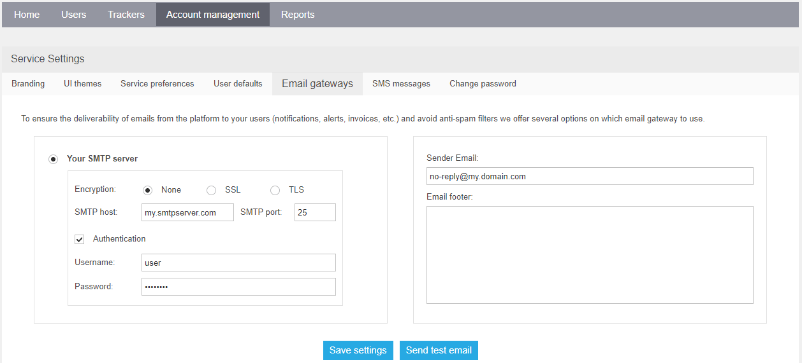

# On-Premise email gateway troubleshooting

Navixy platform has an ability to work with SMTP gateways to send e-mail messages.

Both the default gateway provided by Navixy and the client's own gateway can be used for the platform's PaaS. In the case of Navixy On-premise, clients are limited to using their own SMTP gateway. The Navixy gateway is not an option due to the separation of On-premise servers from the Navixy server infrastructure.

SMTP gateway serves a multitude of purposes:

* Email notifications for alerts;
* Scheduled reports sending;
* Obtaining tachograph DDD files;
* User help requests.

Here we outline troubleshooting steps if you have problems with email delivery.

## Check email gateway settings

First thing to check is whether SMTP gateway is set up in the admin panel.\
Email gateway is specified in the _Account management - Email gateways_ section. Check whether all the settings are specified correctly.



Use _Send test email_ feature for quick troubleshooting. It will prompt you for an address and will send a sample email to it. If the email is not received, proceed to the next step.

## Check messaging service status

If setting seem correct, make sure that [Navixy SMS-server](system-components.md#navixy-sms-server) is up and running. Regardless of its name, this is the service responsible for all the messaging. Without it, neither emails nor SMS can be sent.

[Check the service status](checking-service-statuses.md), and if it is down, try [restarting](../maintenance/restarting-instance.md) it or the entire platform.

If SMS-server is running but messages are still not delivered, proceed to the next step.

## Check service logs

Check [SMS-server log](system-components.md) for any errors.

To find errors related to message delivery to a specific email address, search for log entries containing that email address.

For Linux, use the following command:

```
grep "test@example.com" log.txt
```

For Windows, use any advanced text editor, as the default Notepad is unable to handle large text files properly.

The most common errors in SMTP gateway operation are as follows:

* Incorrect authentication data (login/password).
* SMTP address and/or port unavailable (network issues).
* SMTP address and/or port incorrectly specified.
* Incorrect encryption type selected.

All of the above problems can be clearly identified based on log entries.

If you find any errors indicating a failure on the Navixy platform side, be sure to report them to [technical support](mailto:support@navixy.com), and we will provide all the necessary assistance.
