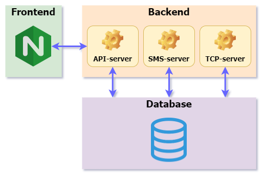

# System components

A comprehensive grasp of the Navixy platform architecture is crucial for effective troubleshooting. In order to proficiently administer and maintain the platform, it is imperative to gain a clear understanding of the component locations, functionalities, and their intricate interdependencies.

The platform's architecture is concisely outlined in the following diagram.

In the following section, we will provide an overview of each Navixy component, outlining its responsibilities and indicating the location of its respective logs.

## Frontend - Website

### Nginx

Navixy uses Nginx as a web-server. It is responsible for serving you static files of the UI and Admin panel.\
If pages do not load at all - this is the first service to check.

Nginx configurations are set during the initial installation of the Navixy platform. They specify the basic parameters for running the website, including paths to website contents and SSL settings.

By default, config files location is:

* Linux: `/etc/nginx/conf/sites-available`
* Windows: `C:\nginx\conf\sites-enabled`

Nginx logs are located in the following directory:

* Linux: `/var/log/nginx`
* Windows: `C:\nginx\logs`

### Web application

All Navixy web application files (the web page content that users see) are stored in the following directories:

* Linux: `/var/www/`
* Windows: `C:\nginx\www`

Inside there are subdirectories for Admin panel files (`panel-v2`) and for User interface files (`pro-ui`).

These files are static and do not change during platform operation. Logging is not performed here.

## Backend - Java services

The backend of the platform consists of three Java services designed to perform specific operations.

### Navixy API-server

API service is responsible for communication between UI and backend.\
It covers login process, obtaining data from the DB for UI and Admin panel, websocket connections, billing of users, all actions on the platform (create,delete,update) and geocoding and routing features.

**Linux:**\
Logs are usually located at /home/java/api-server/log

**Windows:**\
Logs are usually located at C:\java\api-server\log

### Navixy SMS-server

SMS service is responsible for sending SMS, email and push notifications.\
If any of those do not work - you can always find the reason in logs.

**Linux:**\
Logs are usually located at /home/java/sms-server/log

**Windows:**\
Logs are usually located at C:\java\sms-server\log

### Navixy TCP-server

TCP server is responsible for:

* Data exchange between server and devices
* Processing data from devices
* Alert rule triggering
* License authorization process

**Linux:**\
Logs are usually located at /home/java/tcp-server/log

**Windows:**\
Logs are usually located at C:\java\tcp-server\log

## Database - MySQL

Stores all of your data. There are 2 main databases:

* google - has all of the business info
* tracking - has GPS data from devices

**Linux:**\
Configs are usually located at /etc/mysql/mysql.conf.d/mysqld.cnf\
Logs are usually located at /var/log/mysql

**Windows:**\
Configs are usually located at C:\ProgramData\MySQL\MySQL Server 8.0\my.ini\
Logs are usually located at C:\ProgramData\MySQL\MySQL Server 8.0\Data
