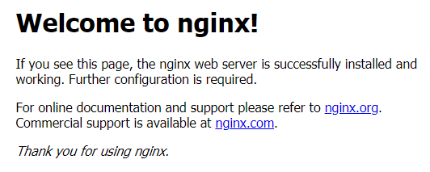
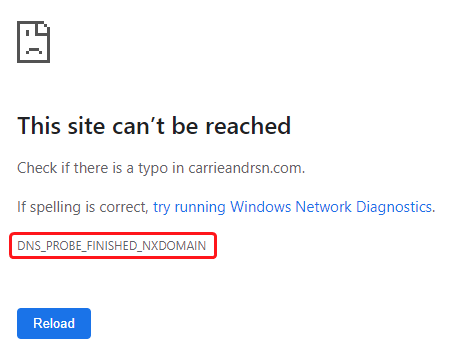
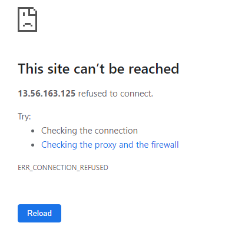
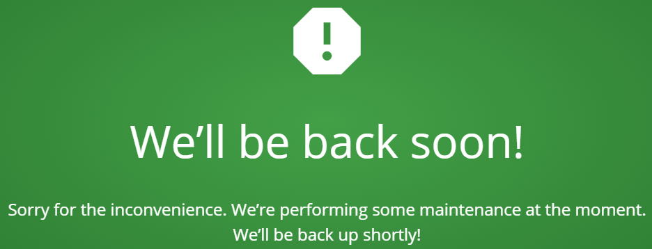
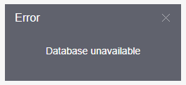
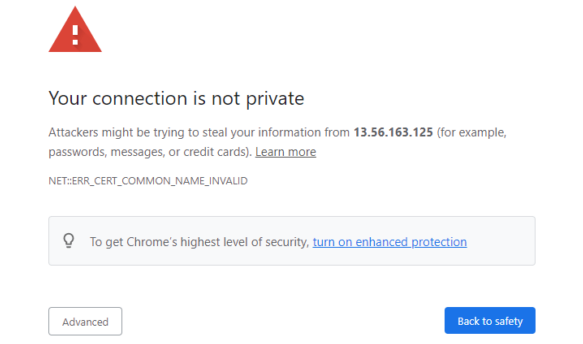

# Web interface

This page provides a comprehensive guide to troubleshooting the most prevalent errors encountered in the Navixy On-premise web interface. It covers both the Admin Panel and User Interface, as they share the Nginx web server, resulting in similar error occurrences. Explore this resource to effectively resolve any issues and optimize your experience.

Nginx welcome page

If you see the Nginx welcome screen, it means that the request has passed through and Nginx is installed and running, but not yet configured.

Things to check:

* The website configs are stored in the following directory:
  * Linux: `/etc/nginx/sites-available`
  * Windows: `C:\nginx\conf\sites-enabled`
* On Linux instances, the symlinks for these files must be made in `/etc/nginx/sites-enabled`

If there are no configs present - please contact Navixy support team.

This site can't be reached (DNS_PROBE_FINISHED_NXDOMAIN)

DNS\_PROBE\_FINISHED\_NXDOMAIN error means that your domain is not pointed to your server or is set up incorrectly.

To resolve the issue, please check that DNS records for the domain are specified correctly.

Domains must have A-type DNS record to functions. Please check [domain requirements](../requirements/domains.md) for more details.

This site can't be reached (ERR_CONNECTION_REFUSED/TIME_OUT)

This error means that connection attempts failed.

Troubleshooting steps:

1. Check that port 80 (HTTP) or 443 (HTTPS) is open and connections are allowed.
2. [Check that Nginx is launched](../requirements/domains.md).
3. On Linux: check if the symlinks for Nginx configs are created in `/etc/nginx/sites-enabled`.
4. If you have edited any of Nginx configurations - restart Nginx.

404 Not Found

If you see such error it means NGINX not properly configured or you’re requesting wrong URL.

Possible ways to solve:

1. Make sure that URLs in Nginx configuration files are correct. Files are located in `/etc/nginx/sites-available/`
2. On Linux: check if necessary sites are enabled. Sites are enabling by creating symlinks in `/etc/nginx/sites-enabled/`
3. Check that static file location specified in Nginx config are correct.

* For Linux, the files are located in `/var/www/`
* For Windows, the files are in `C:\nginx\www`

4. Check that URLs in static files are specified correctly. The files are:

* `./www/panel-v2/PConfig.js`
* `./www/pro-ui/Config.js`
* `./www/pro-ui/static/app_config.js`

5. If you have edited any of the configurations - restart Nginx.

Loading icon or “We’ll be back soon” screen is displayed

If you see a loading icon for extended time periods, or “We’ll be back soon” screen appears - it means that you web server is working and static files are accessible, but UI can't get data from the platfrom.

To resolve the issue:

1. If Admin panel is available, and the problem is only with the user interface - check that correct domain name is specified in the Admin panel (Account Management - Service preferences).
2. Check your browser developer tools. In Chrome-based browsers, press F12, proceed to Network, refresh the page and check the errors. If you see that `get_ui_config` API call fails to execute, in most cases this means API-server is down.
3. [Check API-server status](checking-service-statuses.md). If service is stopped - try restarting it. If service is not launching or crashing after a short while - check its logs to see errors.
4. Check API URL, it may be specified incorrectly in `./www/pro-ui/Config.js`. If this is the case, replace URL with correct one and reload the page.
5. If all points above are fine - check memory consumption and double-check API log file. Perhaps, service has run out of memory.

Database unavailable

Database unavailable message generally means the Java services cannot request data from a database.

Begin with [checking MySQL status](checking-service-statuses.md#database). If MySQL is down - try restarting it and check its logs to find the cause of the failure.

If your database is hosted on a separate server, make sure the connection to it is available on the default MySQL port 3306 (or a custom port if the installation was made this way - check `db.properties` file of any of the Java services).

Your connection is not private

This error tells you that connection is not SSL-protected.

Possible reasons

* You try to access port 443 (with a HTTPS link) and do not have SSL certificate installed.
* Your certificate does not cover the domain name you are accessing.
* Your certificate has expired and you need to issue a new one.
* Your certificate is not set up correctly (not specified in Nginx configuration).


If the above information does not help you to fix the issue, please contact us at [support@navixy.com](mailto:support@navixy.com), and describe the issue in detail, providing logs, configuration files and all the other valuable information that you have. We are always ready to provide comprehensive assistance.

