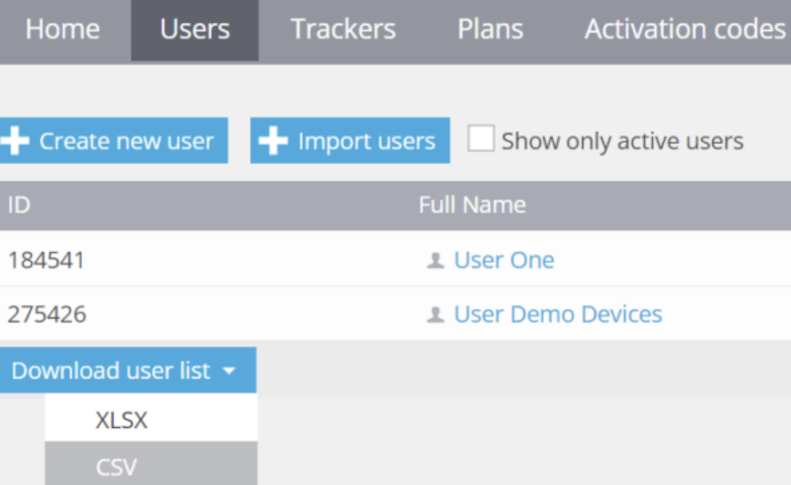
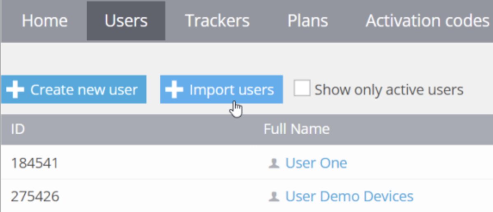
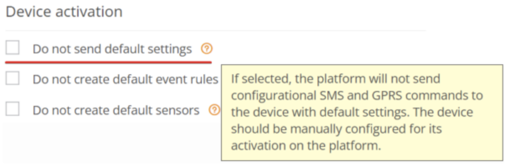

# Migrating users

If you need to migrate your users:

* from one Navixy instance to another
* from a server from a different software vendor to Navixy

you can set up _Data forwarding_ several weeks or months before the user is fully migrated to the new server.

While this method will not transfer the user's entire IoT data, it will enable them to have a seamless experience upon switching to the new instance. By the time the user transitions to the new server, they will be able to access the most recent data there.

## Setting up data forwarding

The following instructions provide guidance on how to transfer multiple users who have several devices to the new Navixy instance from another server.

### **1. Create user accounts on the new Navixy instance**

You can create user accounts manually, but if there you have a longer list of users, you may prefer exporting it from the source server and then import users in the destination instance.

In case the source server is another Navixy instance, you can use "Download user list" feature in the Users menu of the Admin panel.

To upload users to the destination Navixy instance, go to the Admin panel and use the 'Import users' feature. You will need to provide a table file in the suggested template format, with mandatory fields marked with an asterisk (\*).

### 2. Add devices to the new Navixy instance

The next step is to add the devices that will be transferred to the new Navixy instance. That includes adding the list of devices on the destination instance without sending them configuration commands over the air.

**Disable sending configuration commands by the destination Navixy instance**

To prevent sending configuration commands to devices when they are activated on the new Navixy instance, make sure that you enabled the 'Do not send default settings' option in the Device activation section of the Admin Panel under Account management → Service preferences:

It is crucial to check this box to prevent any changes to the device settings and ensure that the devices do not switch to the new Navixy instance prematurely.

**Add the list of devices on the destination Navixy instance**

If you have a small number of devices, you can add them manually. For larger volumes (50 devices or more), use [Bulk device activation](migrating-from-wialon/). Make sure to select the correct device model that corresponds to the actual model of the device when adding new devices.

### 3. Configure data forwarding

Configure data forwarding on the source server. Choose the preferred Data forwarding protocol and server parameters. To complete the process, bind each device to the data stream. Make sure that the device data is received on the destination Navixy instance e.g. by checking that the assets are displayed on the map.

***

After the Data forwarding configuration is complete, allow some time for data to be collected on the new Navixy instance so that users can access their most frequently used and recent data. Although this method will not transfer the user's entire IoT data, it will provide a seamless experience when switching to the new instance
