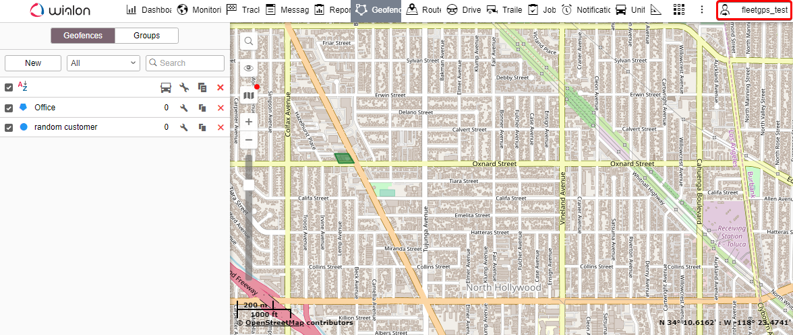
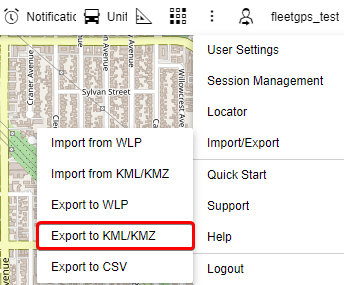
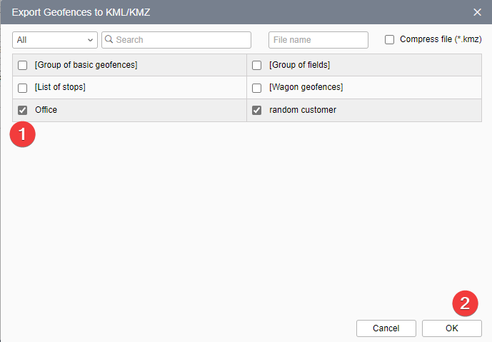
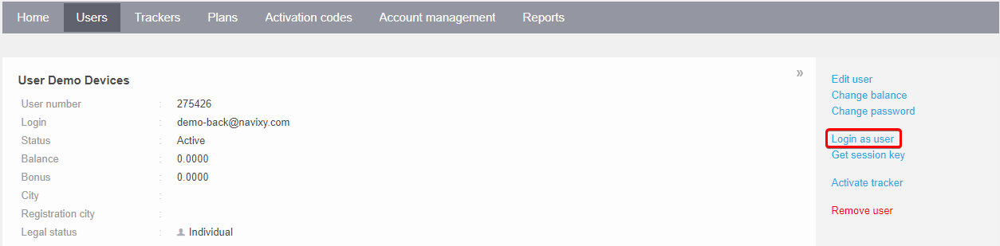
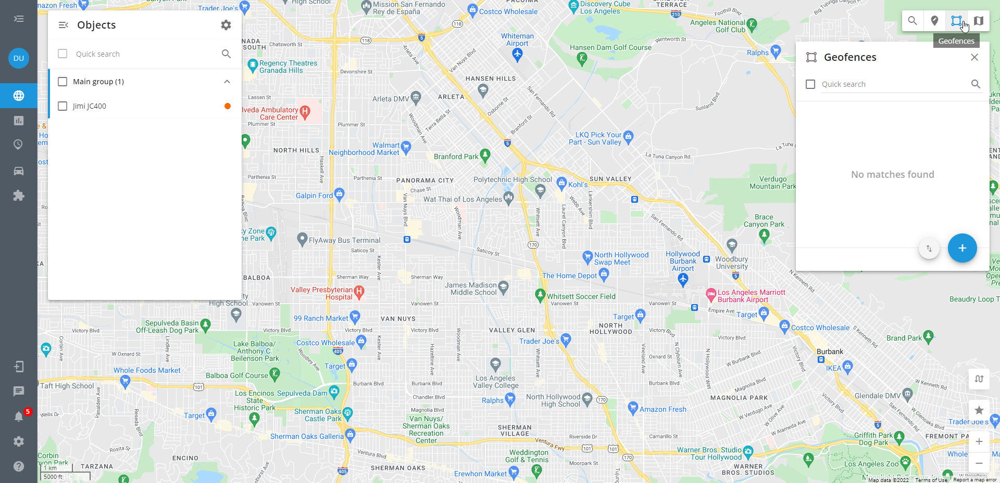
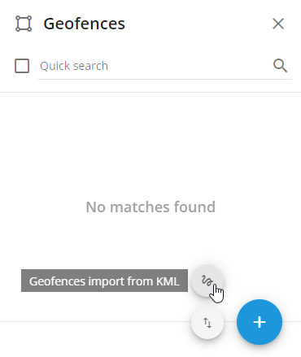

# Geofences migration from Wialon

Geofences can be migrated seamlessly from Wialon to Navixy, allowing your users to continue using them without disruption. To transfer geofences to your users, follow the instruction below.

1. Open user account in Wialon and click on the username in the upper right corner:

2. Select Export to KML/KMZ

3. Select all required geofences to transfer and press OK.

4. Open a user account in Navixy admin panel.

5. And activate geofences section here.

After pointing the cursor over the geofence import, two import options will be displayed. Choose import geofences from a KML file:

6. Add the exported file and specify the default radius for circle geofences.

For polygon geofences, the import will be done exactly as in the Wialon system. For circle geofences, the centers with radiuses specified in the previous step will be transferred. After that, you might need to change the radius of geofences manually. Place the cursor on the required geofence and press the pencil button that appears.

After transferring geofences, they can be used for rules and analytics on the Navixy platform.
