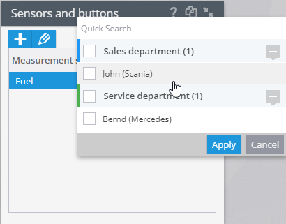
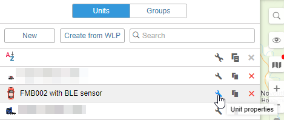
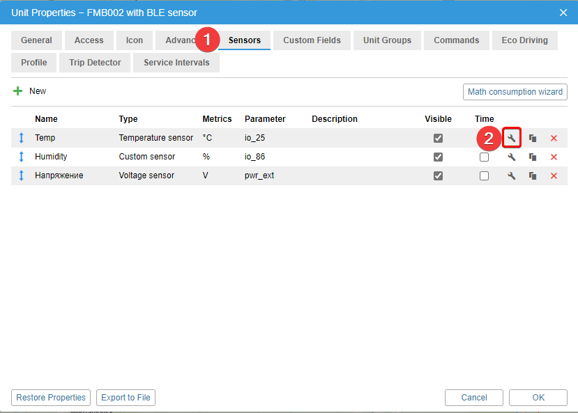
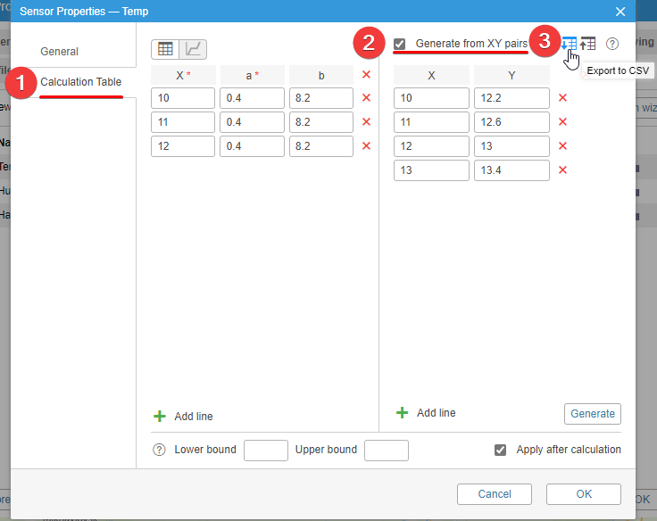
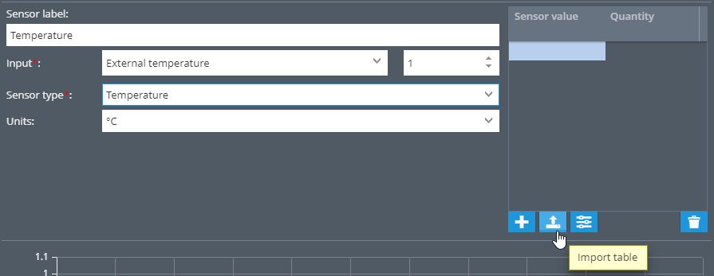

# Sensors migration from Wialon

If you have many devices of the same model with the same sensors in one account, their settings can be copied:

1. First, create and configure all sensors on one of the devices. Note that for digital, CAN and OBD sensors it is not necessary to fill in the calibration tables.
2. Once all sensors are created, select the desired sensor to copy (click on the name) and click on the copy button at the top right.

Then select the desired devices from the list. Only suitable devices will appear in the list, so that you don't have to search for them among all the user's devices.Copying sensors saves you a lot of time and avoids repeating the same steps with each sensor.

## Sensor calibration data

Some sensors may have large calibration tables. You can easily and quickly transfer them to the Navixy platform using .csv files.

1. Create a measurement sensor.
2. Open the window with object properties in Wialon.

3. Select the tab with the sensors and open the properties of the sensor you are transferring.

4. Open the calculation table and turn on the item Generate from XY pairs. A button with export to CSV appears, and when you click it, the table starts downloading.

5. On the Navixy platform, open the sensor settings and click on the Import table button

6. Select the desired file and upload it.

After uploading, all necessary values will be set automatically. From this moment, the platform starts recording information according to the calibration table.
