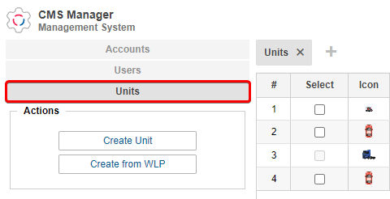
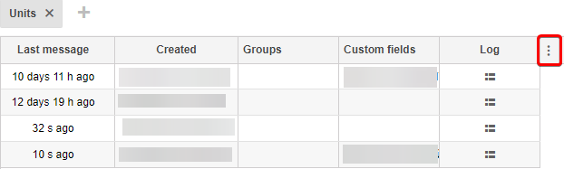
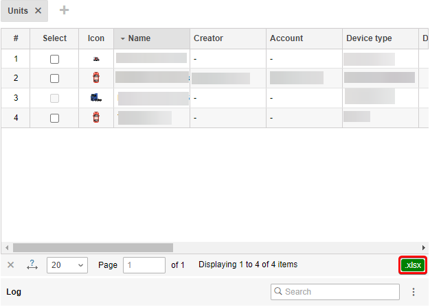
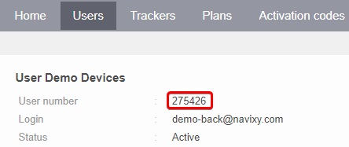

# Trackers migration from Wialon

After you have transferred your users, you need to migrate devices from the Wialon system. Thanks to the [Bulk activation](https://app.gitbook.com/s/KdgeXg71LpaDrwexQYwp/devices/bulk-activation) device migration is quick and convenient.

1. In Wialon CMS, open the units:

In the "Select" column, select the element from which you want to save data to a file. To select multiple items, use the Ctrl key (for a range of items).

2. Next, you need to select the necessary fields to load. Click ... and add all required columns for export:\
   &#x20;

To import devices into the Navixy platform the following information is required:

| File          | Navixy                           | Wialon      |
| ------------- | -------------------------------- | ----------- |
| user\_id      | User ID                          | -           |
| model         | Model                            | Device type |
| label         | Name                             | Name        |
| device\_id    | device's IMEI                    | ID          |
| phone         | Phone number (with country code) | Phone       |
| apn\_name     | APN name                         | -           |
| apn\_user     | APN user                         | -           |
| apn\_password | APN password                     | -           |
| comment       | Comment                          | -           |

The APN settings depend on your device's SIM GSM carrier. It is desirable to specify these data. However, if you will change the IP address and ports of the devices manually, this data is not necessary.

4. To export data, use the .xlsx button in the lower right corner of the table:

5. Download the [example file](https://www.navixy.com/wp-content/uploads/2022/04/hardware-trackers-activation-example.csv) for importing devices to Navixy platform and transfer all fields from the Wialon file. Specify a user\_id as a name, where to load devices.

6. Contact Navixy Technical Support and request to transfer devices. In order to make the migration as fast and convenient as possible, please specify the following information:

* To send/not to send registration commands to devices.
  * If you choose "send" - commands with server and port settings will be sent to all devices, as well as other commands with the platform's default settings. Packet sending mode, sleep mode, events and other devices' settings will be affected.
  * If you select "do not send" - devices will just be registered in the system under users that are specified in the file name. To connect your devices to the platform, change the IP address and port manually. A different port number is used for all manufacturers. See what port number to specify on the next page:\
    [Supported GPS Trackers — Navixy](https://www.navixy.com/devices/).
* Attach a file with filled information and user ID as a name.

After devices transferring, some sensors and rules will be created automatically. Types and number of sensors and rules depend on the device model.
