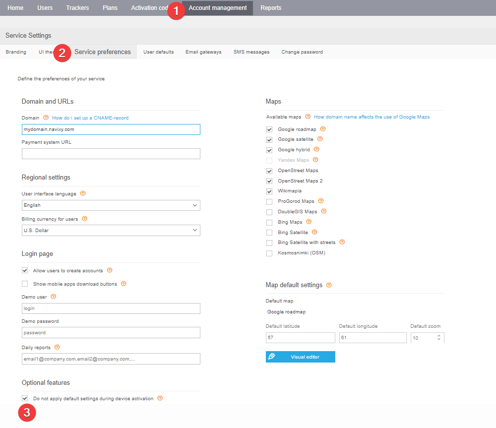
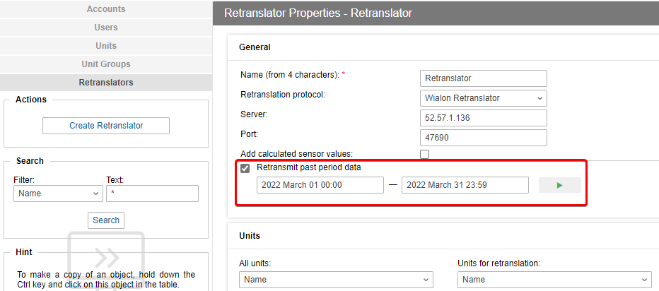
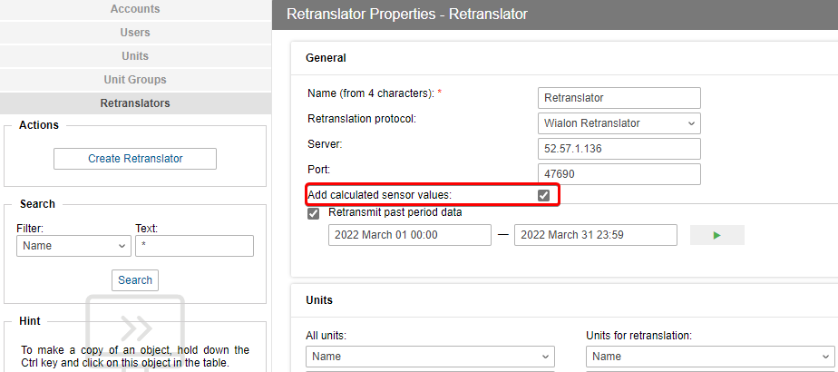
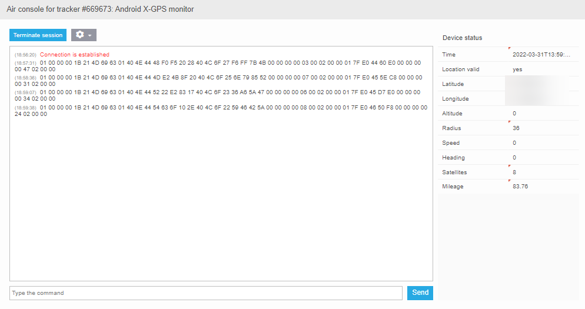
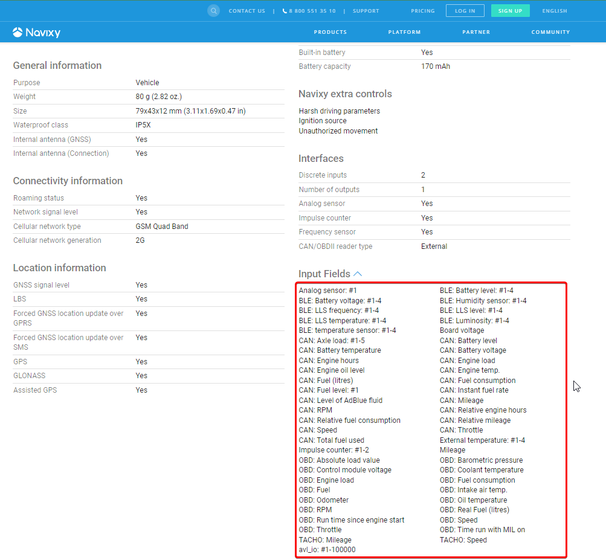
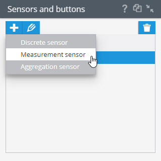

# Tracker data

You can transfer your Wialon data history to Navixy using the Wialon Retranslator tool. Navixy supports the migration of object travel history and sensor data, including position, speed, mileage, number of satellites, fuel level, temperature, voltage, and more.

## Data forwarding speed

The retransmission speed is determined by the sender system and is approximately 20 minutes per month of history for a unit that transmits data every 2 minutes.


Wialon Retranslator transmits data of several objects sequentially. You can create several retranslators to speed up the process.


## Retranslator configuration

* Setting up the retranslator on the sending platform is described on the Wialon website.
* Configuration on the Navixy side is described in the article about sending telematics data to the platform. Use the Wialon Retranslator protocol. The server is the address of your Navixy server. Port: 47690.

## Trip history and sensor data transferring

You can transfer:

* Trip history - to transfer only device trips use items 1 - 3 and 7.
* Sensor history - this process is much more complicated, because Navixy and Wialon process information differently, see items 4 - 6. 4 - 6.

We suggest that your first transfer test includes only one object.

1. Disable sending configuration commands to devices in the admin panel.

2. Activate a unit (tracker) on the Navixy platform, specifying a real device model.

For perfect mileage and track definition, it is important to transfer the history points with ordering from old to new, and the device itself should not send data to the Navixy platform before the final transfer. Otherwise, there may be failures at the history junction.

3. Select past period data and set the required dates.

4. In the retranslator settings in Wialon select "Add calculated sensor values" to get the maximum possible data.

5. In the Navixy [Air Console](https://app.gitbook.com/s/KdgeXg71LpaDrwexQYwp/devices/air-console)  connect to the object and find the name of the sensors to be transferred. The platform supports most of the protocol fields.

6. Check that the same [sensors are supported](https://www.navixy.com/devices/) by Navixy for your actual device model. If supported, the sensor data can be migrated.

7. Add these sensors to the tracking device. Fill in the calibration table if necessary and set the coefficients. Without the addition, the history from the sensors will not be recorded in the database.

The repeater data will be calibrated according to the sensor settings.

8. Configure the device to transmit data to the Navixy platform. You can find out the IP address and server port of the model on the website with [supported models](https://www.navixy.com/devices/).

The trip history and sensor values transfer is complete. Build reports (by trips and by sensors) to check the results of transfer. If sensor data of a real device should be converted differently than the data from a repeater - change the calibration table and coefficients in the device settings.
