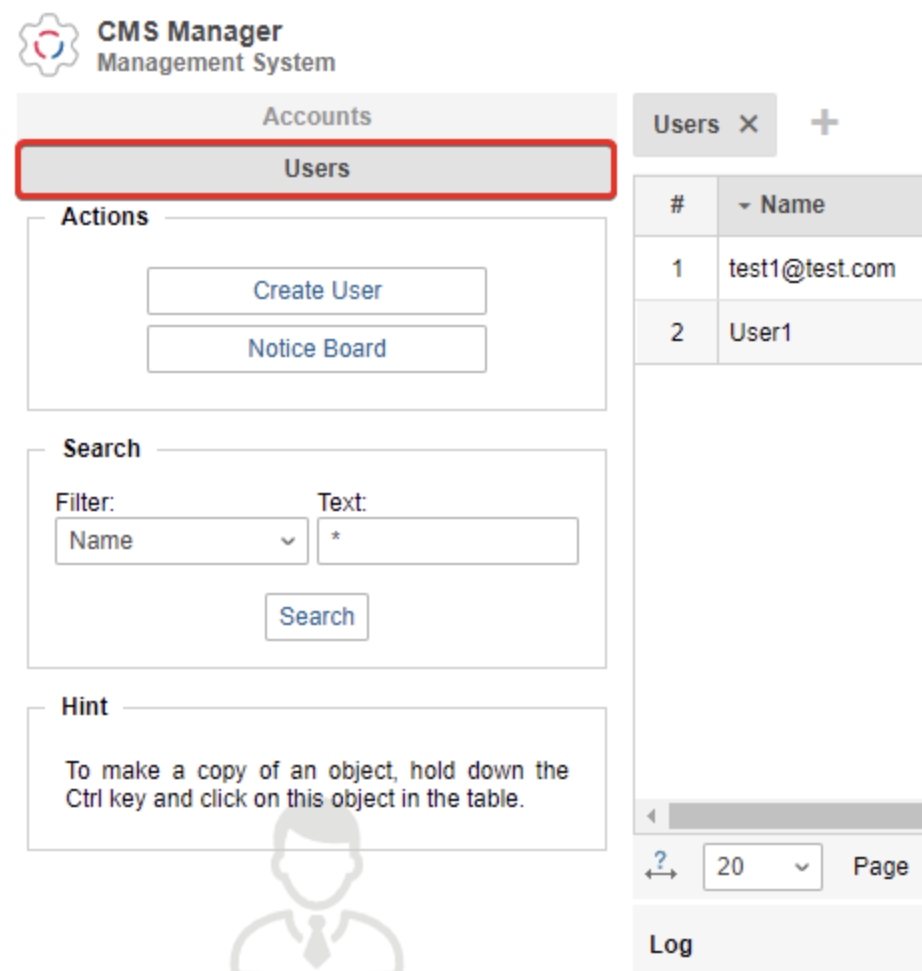
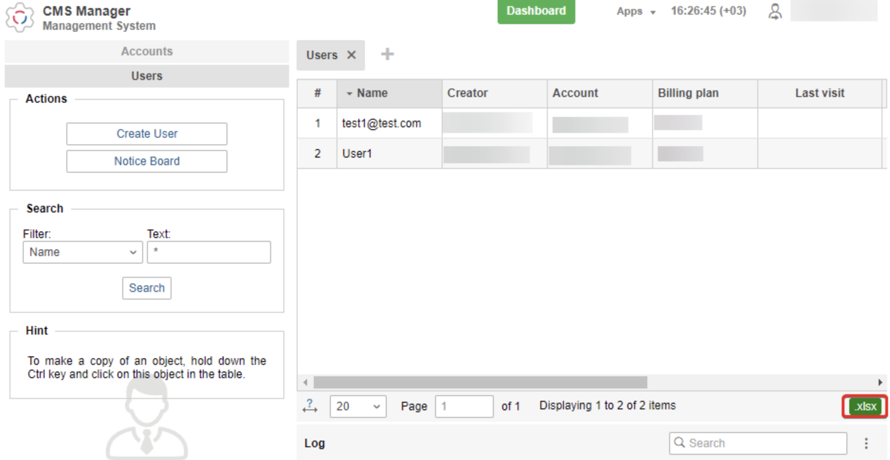
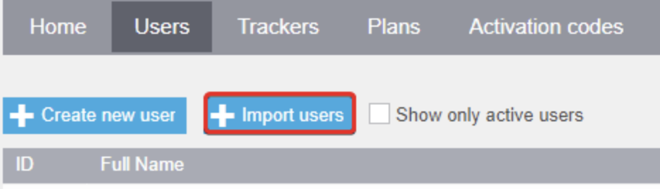
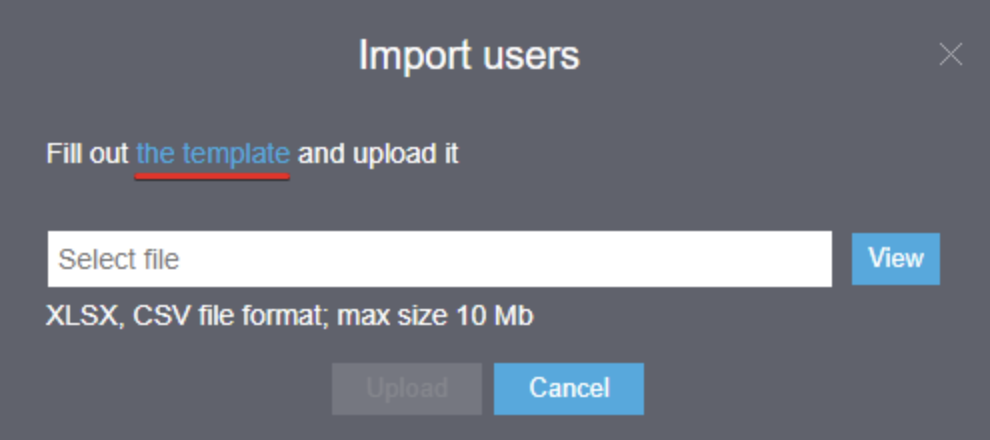

# Users migration from Wialon

The first step in the migration process is to transfer users from Wialon to Navixy. This procedure helps reduce the time it takes to register all your users from your previous system, ensuring that you can quickly and easily migrate your telematics solution to the Navixy platform.

1. On the Wialon CMS system, open the folder with users.\
   
2. Click the .xlsx button in the lower right corner to upload users.

It will allow you to download exclusively the list of usernames, so that you do not forget anyone when migrating.

1. In the Navixy admin panel, select Users and click Import Users.

2. Select a template to load an example file with the required fields.

3. Fill out this file according to your list of users. Required fields: email address, password, status (1 - active, 0 - inactive). All other fields are optional.

User import is complete. All users are now in the Navixy system.
