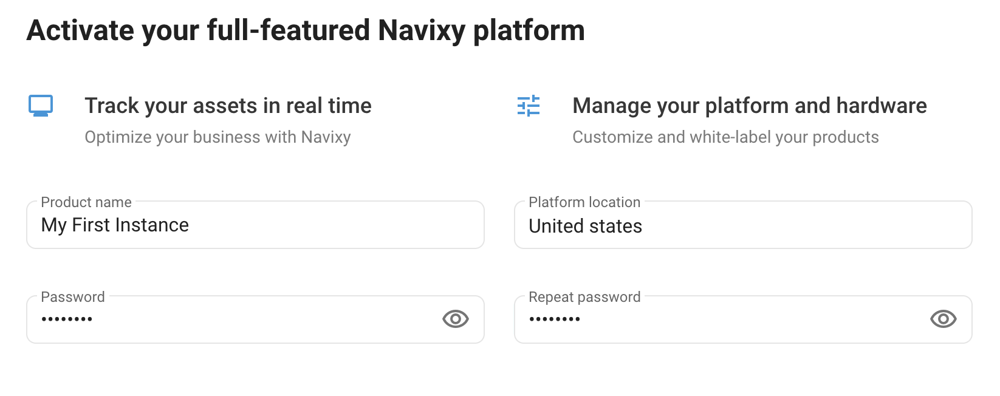
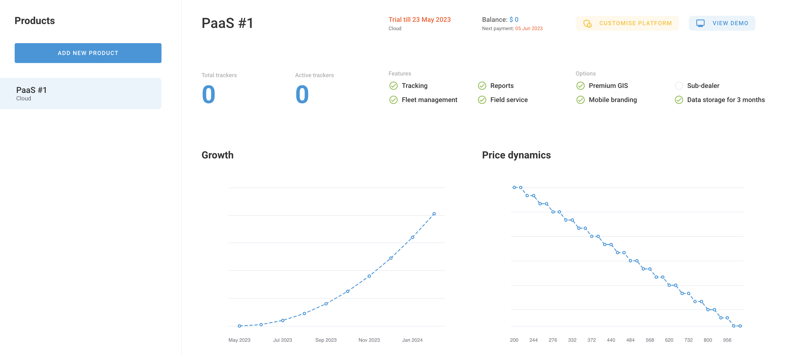

# PaaS

Navixy PaaS (Platform as a Service) is a cloud-based platform that provides a comprehensive set of tools for GPS tracking and telematics applications. It is designed to enable businesses to build and deploy their own GPS tracking systems and telematics applications without having to manage the underlying infrastructure or worry about software updates, maintenance, and security.

## Launching Navixy PaaS instance

To create Navixy PaaS instance, login to the [Customer portal](https://portal.navixy.com/) and click "Create product" button. In the dialog, you will be prompted to create your instance of the Navixy platform.

Continue through the dialog to create your Navixy PaaS instance. The instance will be created momentarily and you will be able to [Manage](../on-premise/how-to-guide/) the platform using the [Admin panel](https://panel.navixy.com), such as changing the URL address of the user web interface (by default it will be `https://*****.navixy.com`), branding, regional settings and more.

If you have any questions or difficulties related to your PaaS deployment, please don't hesitate to [contact](https://navixy.com/contact) our customer success team for a demo and guidance.
