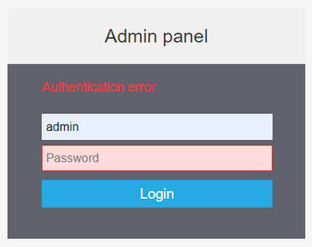

# Subscription fees

Navixy requires a monthly subscription fee for both PaaS and On-Premise instances. The fee is based on the number of active devices used during the month, with no charge for inactive devices or clones. An invoice is issued at the beginning of each month, and payment is due by the 10th of that month to ensure continued service.

To ensure uninterrupted operation of the server on the subscription, timely payment is required by the 10th of each month. If payment is not made, the instance will be suspended until the necessary funds are received. Please note that delayed payments due to banking system issues or other reasons can also cause the instance to be suspended until the funds are credited.


If you have any questions related to payment processing or platform suspension due to non-payment, please [contact](https://navixy.com/contact/) our customer success team. Please note that technical support is not provided for suspended instances.


## Service suspension

When payment is not received on time, access to the Navixy platform is suspended, which is indicated by an authentication error displayed to the user.

The subscription process involves two stages of suspending access in the event of not receiving the monthly payment:

* On the 10th of the following month, access to the admin panel is suspended while tracking data is still processed and user accounts remain available.
* On the 15th of the following month, the platform is completely suspended, and access to user accounts is closed. Device data stops being processed as well.

## Service resumption

To resume your subscription, please make sure your payment is made. You can [contact](https://navixy.com/contact/) our customer success team if you have any questions regarding your payment.

As soon as the necessary payment is received for the suspended instance, the service will resume automatically:

* for PaaS instances, the service will be resumed immediately;
* for On-Premise instances, the service will be resumed on the day when the instance connects to the authentication server to verify the license. To expedite the verification process, you can use the restart-navixy script (for Linux only) or restart tcp-server (for all operating systems). After restarting the service, the platform will connect to the authentication server, verify the balance, and unblock the instance.

## On-Premise license verification and renewal

The On-Premise instances transmit information to the authentication server [auth.navixy.com](http://auth.navixy.com) through port **32233** that is necessary for billing purposes, such as the number and models of active devices. This transmission is critical for ensuring correct billing and license renewal for the following month while the subscription is active.
